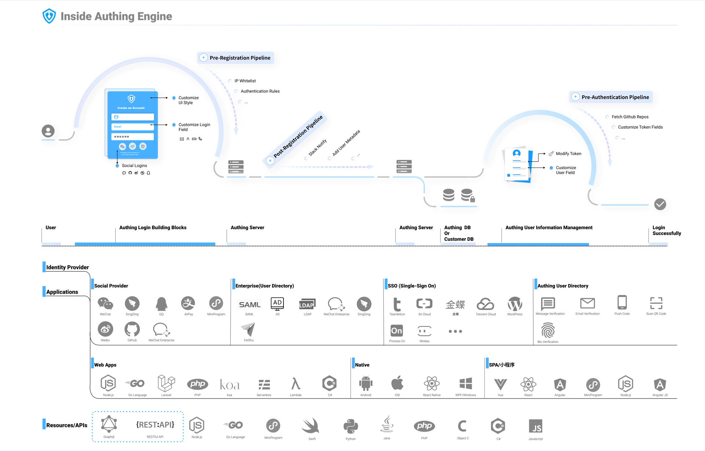

# 什么是 {{$localeConfig.brandName}}

<LastUpdated/>

{{$localeConfig.brandName}} 在云上为企业和开发者提供专业的身份认证和授权服务。

你可以将任意平台的应用接入到 {{$localeConfig.brandName}}（无论是新开发的应用还是老应用都可以），同时你还可以自定义应用程序的登录方式（如：邮箱/密码、短信/验证码、社会化登录等）。

你可以根据你使用的技术，来选择我们的 SDK 或调用相关 API 来接入你的应用。当用户发起授权请求时，{{$localeConfig.brandName}} 会帮助你认证他们的身份和返回必要的用户信息到你的应用中。

## Inside Authing Engine

## 为什么要使用 {{$localeConfig.brandName}}

下面是我们整理的 {{$localeConfig.brandName}} 的部分使用场景：

- 你想开发一个很酷的程序，这时你想添加用户身份认证和授权。你希望你的用户能使用微信、GitHub 登录，同时你还希望能追踪到用户的注册来源，活动数据，以便你做后续的用户增长。
- 你做了一个 API，同时你希望能使用 OAuth 2.0 协议保证 API 的安全。
- 你做了很多应用程序，你希望这些应用程序的用户数据可以通过单点登录（Single Sign On）的方式互通。
- 你做了一个 JavaScript 前端应用和一个移动端应用，你希望这两个客户端应用都可以安全的访问你的 API。
- 你需要做一个支持 SAML 登录的 Web 应用程序。
- 你觉得密码非常脆弱，所以你想让用户使用一次性的手机验证码或邮箱验证码登录。
- 如果你用户的密码在其他网站上被泄漏了，你希望能得到通知，以便你通知你的用户去重置密码。
- 如果有用户连续登录失败，你希望禁止他们的 IP，以防止 DDOS 攻击或暴力破解密码。
- 你在一家大型企业中，该企业希望联合其现有的企业目录，以允许员工使用其现有的企业凭据登录各种内部和第三方应用程序。
- 你不想（或者你不知道如何）实现自己的用户管理解决方案。也不想开发密码重置，创建，配置，阻止和删除用户这些重复性的 UI，你只想专注于你自己的业务研发和产品设计，这时你可以选择 {{$localeConfig.brandName}} 作为认证中间件。
- 你希望在用户想要访问敏感数据时强制执行多重身份验证。
- 你正在寻找一种身份解决方案，可以帮助你兼容 SOC2，GDPR，OpenID Connect 等不断增长的合规性要求。
- 你希望使用数据分析来跟踪你网站或应用上的用户，同时希望使用此数据拓展获客渠道，衡量用户留存率并逐步改善注册流程。

## {{$localeConfig.brandName}} 遵循了哪些行业标准？

曾几何时，当计算机还是独立系统时，或者说互联网没有爆发时，所有的身份认证和用户数据都存在于一台计算机中。现在时代变了，你可以在多个应用和网站上使用相同的登录信息（比如随处可见的「使用微信登录」），这是大家通过遵循同一种身份认证标准实现的。
这些标准是一套开放式规范和协议，遵循这套标准可以帮助开发者和企业设计良好的身份认证和授权系统，同时规定了如何正确的管理身份、转移数据以及授权。

**{{$localeConfig.brandName}} 使用的行业标准协议包括:**

- **OAuth 2.0:** 一种授权标准，允许用户在一个站点向其他站点授予对其资源的有限访问权限，而无需获得其凭证（通常是账号密码）。举个例子，你在手机上点击「使用微信登录」时都会使用此标准，并且系统会询问你是否同意与该应用共享你的头像、昵称等数据。
- **Open ID Connect:** 这是 OAuth 2.0 的一个超集，他在 OAuth 2.0 之上提供了更多用户信息和获取权限和标准，比如他定义了用户的头像为 picture。
- **JSON Web Tokens:** 一种开放标准，主要用来安全的传输信息，他的格式非常紧凑和独立，解析之后是一种 JSON 格式。
- **Security Assertion Markup Language (SAML):** 一种基于 XML 的开放数据格式，SAML 允许企业应用程序和内部、外部程序无缝连接。
- **LDAP:** LDAP 是轻量目录访问协议，英文全称是 Lightweight Directory Access Protocol，一般都简称为 LDAP。你可以把它理解为一个树型的用来存储用户和组织信息的数据库，常被用来做单点登录（ SSO ）和企业员工信息管理。
- **CAS**: 集中式认证服务（Central Authentication Service，简称 CAS）是一种单点登录协议。它的目的是允许一个用户访问多个应用程序，而只需向认证服务器提供一次凭证（如用户名和密码）。这样用户不仅不需在登录 Web 应用程序时重复认证，而且这些应用程序也无法获得密码等敏感信息。

