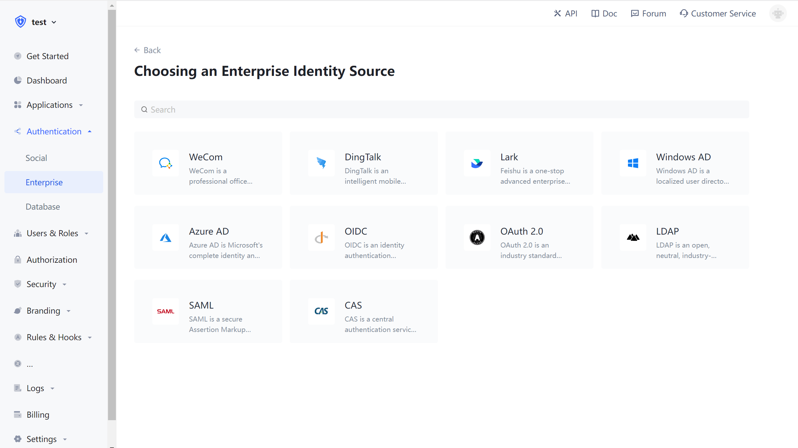
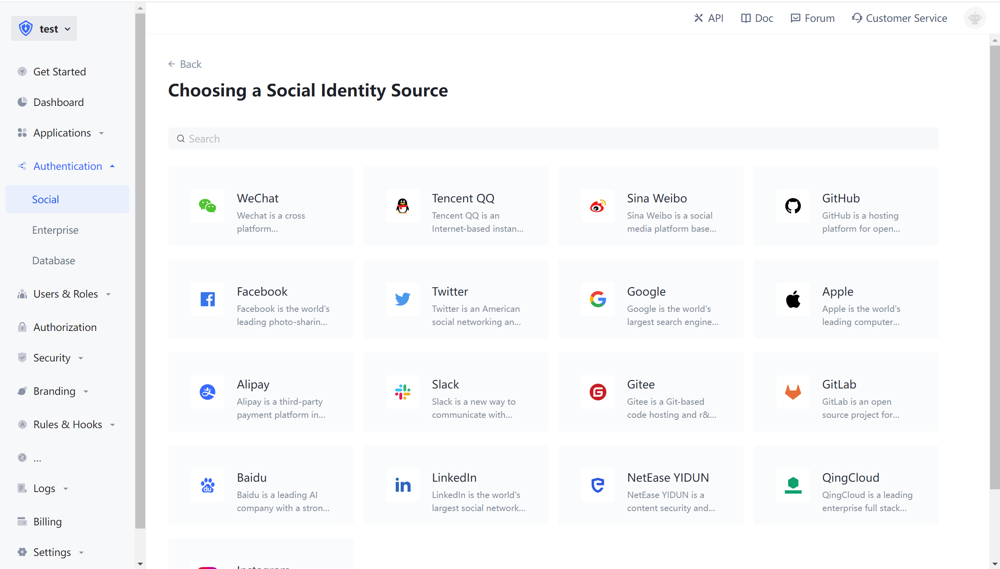
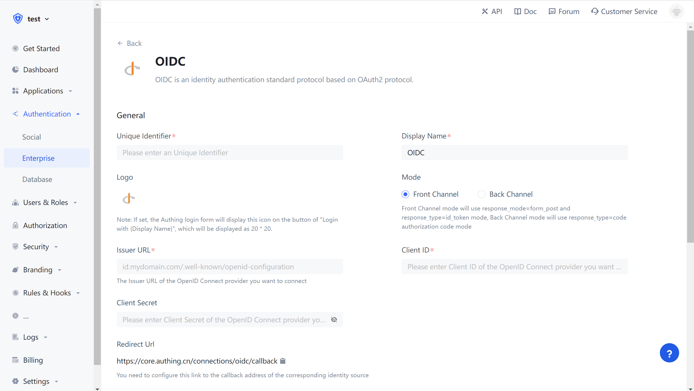
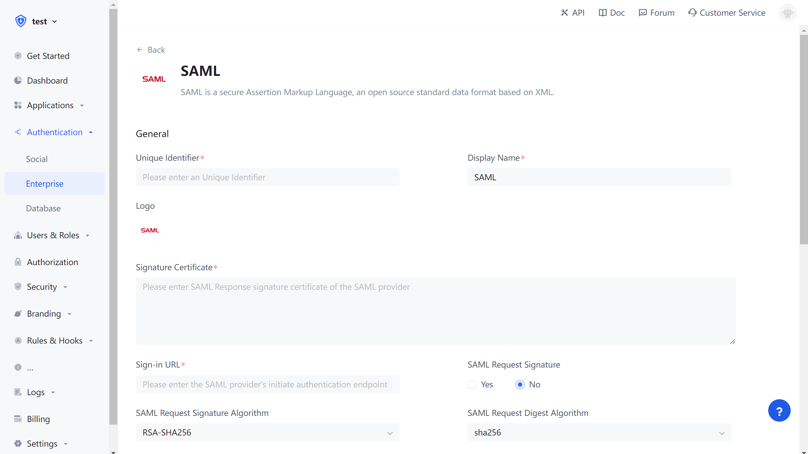
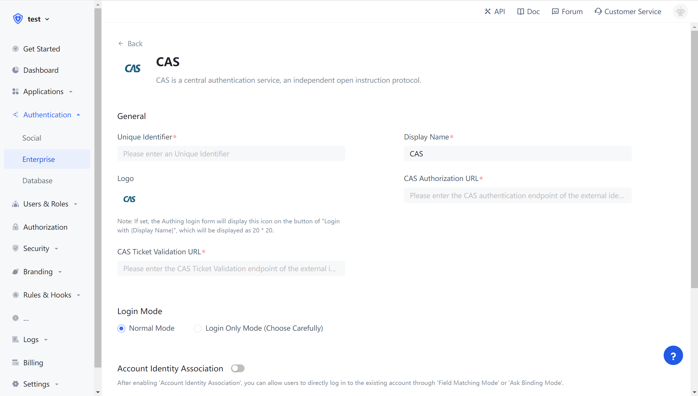

# What is Federated Authentication

<LastUpdated/>

In the early generation of the Internet, users’ with various accounts hold private information that would be scattered across different sites and applications. This have lead the following problems:

1. Every time a user visits a new site, they must register an account with a new username and password.
2. This account is only stored on this site.
3. The end user is unable to save the logged in on different sites. User information cannot be shared between these sites.
   The Federated Authentication unites different identity providers to authenticate users through standard protocols. Federated Authentication has a strong trust relationship between these organizations. Identity providers can establish a federated relationship and can get user information from each other through standard protocols.

## Why do you need Federated Identity Authentication

Federated Authentication is a decentralized authentication. When a user logs in at an identity provider, the user can choose to log in to a federal identity provider trusted by the current identity provider. Users can log in to a new system through Federated Authentication without registering an account in the new organization. For example, many websites now have their registration and login methods; One way to log in is the app WeChat, it can scan codes to login directly. Among them, WeChat is the identity provider of this website. End users do not need to fill in the information to register an account and log in directly using WeChat.

Using Federated Authentication has the following benefits:

1. Users do not have to create a new account.
2. After accessing federation, users can switch between different organizations and sites without extra authentication.

## Principles of Federated Authentication

The following is the process of Federated Authentication. The end user is redirected to the federated identity for Authentication. First, the end user authenticates in the federated identity. Then, the federated identity sends an assertion to Authing, which is equivalent to the user completing the Authentication in Authing. Authing sends the assertion to the business system, and the login completes.

## Authing's Federated Authentication capabilities

Authing supports multiple [standard protocols](https://federation-poc.authing.cn/) for Federated Authentication.

## OAuth2

Authing supports a variety of [social login](/guides/connections/social.md) services, and [customize OAuth2 social login](/connections/custom-social-provider/).

## OpenID Connect

Authing supports federated authentication using [OIDC](/connections/oidc/)。

## SAML2

Authing supports federated authentication using [SAML2](/connections/saml/).

## CAS

Authing supports the use of [CAS](/connections/cas/) for federated authentication.

