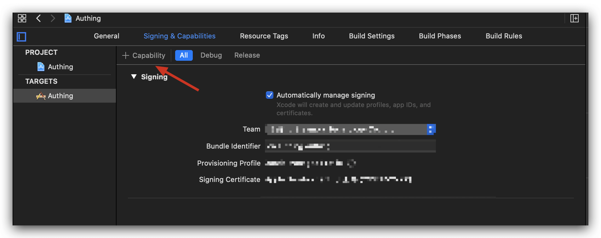
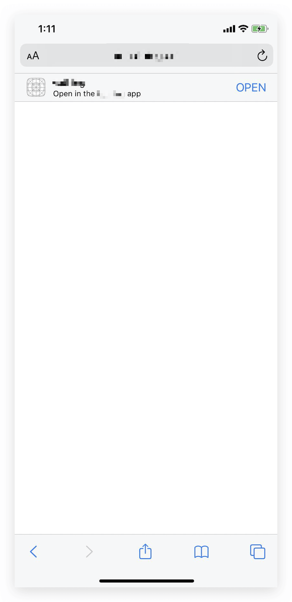

<IntegrationDetailCard title="在微信开放平台创建一个移动应用">

### 配置 iOS Universal Links

> 从微信 WechatOpenSDK 1.8.6 开始，iOS 移动应用需填写 Universal Links 信息。如果你是要开发 Android 应用或者已经配置好了，可跳过此节。[Apple 官方文档请见此](https://developer.apple.com/documentation/uikit/inter-process_communication/allowing_apps_and_websites_to_link_to_your_content/enabling_universal_links)。

#### 配置 apple-app-site-association 文件

在 Apple Developer 控制台 **Membership** 页面找到自己的 Team ID:


在 Xcode **Targets** -&gt; **Signing & Capabilities** 中找到 Bundle Identifier:


接下来创建 apple-app-site-association 文件：

假设你的 Team ID 为 xxxxxxx, Bundle Identifier 为 com.example.exampleApp, 设置 Universal Link 的 Path 为`/native/*`, 则 apple-app-site-association 如下：

假设你的 Team ID 为 xxxxxxx, Bundle Identifier 为 com.example.exampleApp, 设置 Universal Link 的 Path 为`/native/*`, 则 apple-app-site-association 如下：

```json
{
  "applinks": {
    "apps": [],
    "details": [
      {
        "appIDs": ["xxxxxxx.com.example.exampleApp"],
        "paths": ["/native/*"]
      }
    ]
  }
}
```

你需要将此文件部署到你的域名的 .well-known/apple-app-site-association 链接下，如你的域名为 example.com，则需要通过 https://example.com/.well-known/apple-app-site-association 访问到该文件。以下几点需要注意：

- **必须 Use https**
- apple-app-site-association 需要是一个合法的 JSON 文件，但是**没有 .json 后缀**。
- content-type 需要设置为 application/json
- paths 请**Use \* 通配符**，微信要求。

以下是一个 nginx 配置示例：（这里将 apple-app-site-association 文件放与某个 .well-known 文件夹下）

```nginx
server {
  listen 80;
  listen 443 ssl;

  server_name authing.cn;

  ssl_certificate /mnt/cerm/client/1_authing.cn_bundle.crt;
  ssl_certificate_key /mnt/cerm/client/2_authing.cn.key;
  ssl_session_timeout 5m;
  ssl_ciphers ECDHE-RSA-AES128-GCM-SHA256:ECDHE:ECDH:AES:HIGH:!NULL:!aNULL:!MD5:!ADH:!RC4;
  ssl_protocols TLSv1 TLSv1.1 TLSv1.2;
  ssl_prefer_server_ciphers on;


  location /.well-known {
    alias /path/to/your/.well-known/folder;
    try_files $uri $uri/ =404;
  }
}
```

#### 在 Xcode 中配置 Associated Domains

加下来在 Xcode 中配置 Associated Domains。 在 Xcode **Targets** -&gt; **Signing & Capabilities** 页面点击右上角的 **+Capability** :



选择 Associated Domains:


假设你的域名是 example.com, 则填入 `applinks:example.com` :


#### 验证 Universal Links 是否生效

假设你的域名为 example.com，Path 为 `/native/*`在手机上安装了你的 App 之后，Use Safari 浏览器访问 `https://example.com/native/`，网上拉动网页，你应该能看到你的 App:



再访问 `https://example.com/native/xxx`，依旧可以看到。

#### 在微信开放平台填写 Universal Links


</IntegrationDetailCard>
