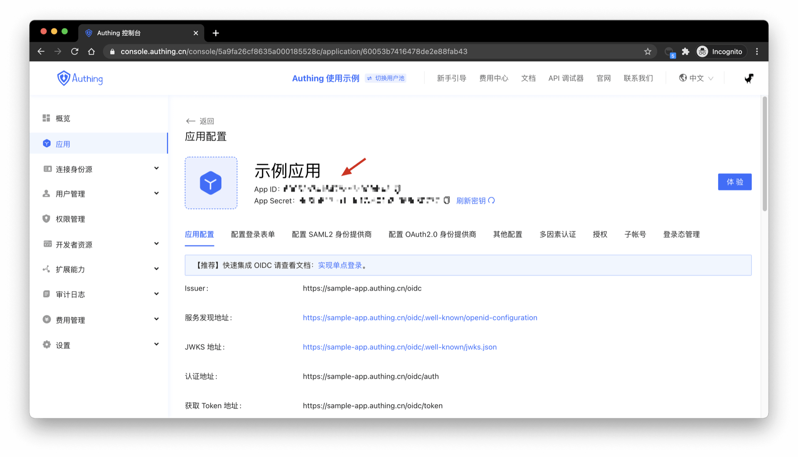

# How To Validate User Token?

<LastUpdated/>

Authentication Token is divided into two modes: local authentication and online authentication using Approw. We recommend **verifying the JWT Token locally**, because it saves your server bandwidth and speeds up the verification. You can also choose to send the token to the authentication interface of Approw, which will be verified by Approw and return the result, but this will cause network delays, and there may exist slow requests when the network is congested.
The following is a comparison of the advantages and disadvantages of local verification and online verification:

|                     | Verification speed | Code complexity | Reliability                  |
| ------------------- | ------------------ | --------------- | ---------------------------- |
| Online verification | Slow 🐢            | simple          | Single point of failure risk |
| Local verification  | Fast 🐇            | moderate        | Distributed system           |

## Local verification

### Use the application key to verify the Token signed by the HS256 algorithm

If you **directly** call the login method (loginByEmail, loginByPhone, loginByUsername) or use **OIDC authorization**, and the IdToken signature algorithm type is set to **HS256**, please use this method to verify the Token.‌
The key can be obtained in the **console>application>application details**, as shown in the figure below:



The following code to verify the legality takes Node as an example (need to install [JSON Web Token](https://www.npmjs.com/package/jsonwebtoken)).

```javascript
const jwt = require('jsonwebtoken')
try {
  let decoded = jwt.verify('JSON Web Token from client', 'your_secret'),
    expired = Date.parse(new Date()) / 1000 > decoded.exp
  if (expired) {
    // 过期
  } else {
    // 合法也没过期，正常放行
  }
} catch (error) {
  // 不合法
}
```

To avoid exposing the application key on the client side, please verify the validity of the id_token through the application key on the server side.‌

### Use the application public key to verify the IdToken signed by the RS256 algorithm

If you use the **RS256** signature algorithm, you need to use the **public key** to verify the signature. Approw uses a private key to sign the application, please use `https://<application domain>.approw.cn/oidc/.well-known/jwks.json` to verify the signature. Both **access_token** and **id_token** issued by Approw can be verified with the above public key.

If you use javascript, you can use the jose library to verify the RS256 signature:

> Please use jose library under version 2.x.x, newer versions are incompatible with the code below.

```javascript
const jose = require('jose')
// 下面的参数内容是将 https://<应用域名>.Approw.cn/oidc/.well-known/jwks.json 返回的内容原封不动复制过来
const keystore = jose.JWKS.asKeyStore({
  keys: [
    {
      e: 'AQAB',
      n:
        'o8iCY52uBPOCnBSRCr3YtlZ0UTuQQ4NCeVMzV7JBtH-7Vuv0hwGJTb_hG-BeYOPz8i6YG_o367smV2r2mnXbC1cz_tBfHD4hA5vnJ1eCpKRWX-l6fYuS0UMti-Bmg0Su2IZxXF9T1Cu-AOlpgXFC1LlPABL4E0haHO8OwQ6QyEfiUIs0byAdf5zeEHFHseVHLjsM2pzWOvh5e_xt9NOJY4vB6iLtD5EIak04i1ND_O0Lz0OYbuV0KjluxaxoiexJ8kGo9W1SNza_2TqUAR6hsPkeOwwh-oHnNwZg8OEnwXFmNg-bW4KiBrQEG4yUVdFGENW6vAQaRa2bJX7obn4xCw',
      kty: 'RSA',
      alg: 'RS256',
      use: 'sig',
      kid: 'TfLOt3Lbn8_a8pRMuessamqj-o3DBCs1-owHLQ-VMqQ',
    },
  ],
})
// 选项中 issuer 的内容是 https://<应用域名>.Approw.cn/oidc，audience 的内容是 应用 ID
// id_token 很长，请向右滑动 ->
const res = jose.JWT.IdToken.verify(
  'eyJhbGciOiJSUzI1NiIsInR5cCI6IkpXVCIsImtpZCI6IlRmTE90M0xibjhfYThwUk11ZXNzYW1xai1vM0RCQ3MxLW93SExRLVZNcVEifQ.eyJzdWIiOiI1ZjcxOTk0NjUyNGVlMTA5OTIyOTQ5NmIiLCJiaXJ0aGRhdGUiOm51bGwsImZhbWlseV9uYW1lIjpudWxsLCJnZW5kZXIiOiJVIiwiZ2l2ZW5fbmFtZSI6bnVsbCwibG9jYWxlIjpudWxsLCJtaWRkbGVfbmFtZSI6bnVsbCwibmFtZSI6bnVsbCwibmlja25hbWUiOm51bGwsInBpY3R1cmUiOiJodHRwczovL2ZpbGVzLmF1dGhpbmcuY28vdXNlci1jb250ZW50cy9waG90b3MvOWE5ZGM0ZDctZTc1Ni00NWIxLTgxZDgtMDk1YTI4ZTQ3NmM2LmpwZyIsInByZWZlcnJlZF91c2VybmFtZSI6InRlc3QxIiwicHJvZmlsZSI6bnVsbCwidXBkYXRlZF9hdCI6IjIwMjAtMDktMzBUMDc6MTI6MTkuNDAxWiIsIndlYnNpdGUiOm51bGwsInpvbmVpbmZvIjpudWxsLCJlbWFpbCI6InRlc3QxQDEyMy5jb20iLCJlbWFpbF92ZXJpZmllZCI6ZmFsc2UsInBob25lX251bWJlciI6bnVsbCwicGhvbmVfbnVtYmVyX3ZlcmlmaWVkIjpmYWxzZSwibm9uY2UiOiJFNjViMVFvVVl0IiwiYXRfaGFzaCI6IkIzSWdPWUREYTBQejh2MV85cVpyQXciLCJhdWQiOiI1ZjE3YTUyOWY2NGZiMDA5Yjc5NGEyZmYiLCJleHAiOjE2MDE0NTM1NTgsImlhdCI6MTYwMTQ0OTk1OSwiaXNzIjoiaHR0cHM6Ly9vaWRjMS5hdXRoaW5nLmNuL29pZGMifQ.Z0TweYr9bCdYNJREVdvbJYcjXSfSsSNHBMqxTJeW-bnza0IIpBpEEVxlDG0Res6FZbcVzsQZzfJ9pj_nFgLjZxUUxv7Tpd13Sq_Ykg2JKepPf3-uoFqbORym07QEj4Uln0Quuh094MTb7z6bZZBEOYBac46zuj4uVp4vqk5HtCUSB4ASOAxwi7CeB1tKghISHz6PDcf6XJe_btHdzX1dparxtML-KvPxjpcHlt5emN88lpTAOX7Iq0EhsVE3PKrIDfCkG8XlL5y9TIW2Dz2iekcZ5PV17M35G6Dg2Q07Y_Apr18_oowOiQM5m_EbI90ist8CiqO9kBKreCOLMzub4Q',
  keystore,
  {
    issuer: 'https://oidc1.Approw.cn/oidc',
    audience: '5f17a529f64fb009b794a2ff',
  }
)
console.log(res)
```

Result:

```javascript
{
  sub: '5f719946524ee1099229496b',
  birthdate: null,
  family_name: null,
  gender: 'U',
  given_name: null,
  locale: null,
  middle_name: null,
  name: null,
  nickname: null,
  picture: 'https://files.Approw.co/user-contents/photos/9a9dc4d7-e756-45b1-81d8-095a28e476c6.jpg',
  preferred_username: 'test1',
  profile: null,
  updated_at: '2020-09-30T07:12:19.401Z',
  website: null,
  zoneinfo: null,
  email: 'test1@123.com',
  email_verified: false,
  phone_number: null,
  phone_number_verified: false,
  nonce: 'E65b1QoUYt',
  at_hash: 'B3IgOYDDa0Pz8v1_9qZrAw',
  aud: '5f17a529f64fb009b794a2ff',
  exp: 1601453558,
  iat: 1601449959,
  iss: 'https://oidc1.Approw.cn/oidc'
}
```

## Online verification

### Online verification of OIDC IdToken

This endpoint can detect `access_token` and `id_token` effectiveness `refresh_token` can not be detected.

- Interface Description: check whether issued `access_token` or `id_token` is valid.

- Interface Endpoint:`GET` `https://<your application domain>.Approw.cn/api/v2/oidc/validate_token`

- Request parameters:

| Parameter    | Types of | Is it required | Description                 |
| ------------ | -------- | -------------- | --------------------------- |
| access_token | string   | no             | The content of AccessToken. |
| id_token     | string   | no             | The content of the IdToken. |

- Return data:

When `access_token` or `id_token` is legal, return decoded content of `access_token`/`id_token`

```json
// access_token 检验后的返回结果：
{
    "jti": "K5TYewNhvdGBdHiRifMyW",
    "sub": "5f64afd1ad501364e3b43c1e",
    "iat": 1601456894,
    "exp": 1601460494,
    "scope": "openid profile email phone",
    "iss": "https://oidc1.Approw.cn/oidc",
    "aud": "5f17a529f64fb009b794a2ff"
}

// id_token 检验后的返回结果：
{
    "sub": "5f64afd1ad501364e3b43c1e",
    "birthdate": null,
    "family_name": null,
    "gender": "U",
    "given_name": null,
    "locale": null,
    "middle_name": null,
    "name": null,
    "nickname": null,
    "picture": "https://usercontents.Approw.cn/Approw-avatar.png",
    "preferred_username": "test1",
    "profile": null,
    "updated_at": "2020-09-27T06:06:29.853Z",
    "website": null,
    "zoneinfo": null,
    "email": "test1@123.com",
    "email_verified": false,
    "phone_number": null,
    "phone_number_verified": false,
    "nonce": "CQsguqUdl7",
    "at_hash": "10iOtwuTNtyQLzlNYXAHeg",
    "aud": "5f17a529f64fb009b794a2ff",
    "exp": 1601460494,
    "iat": 1601456894,
    "iss": "https://oidc1.Approw.cn/oidc",
}
```

If `access_token` or `id_token` is illegal, it returns the following error message

```javascript
{
  code: 400,
  message: 'id_token 不合法',
}

{
  code: 400,
  message: 'access_token 不合法',
}
```

### Online verification OAuth2 AccessToken

- Interface Description: You can verify whether `access_token` or `refresh_token` is valid.

- Interface Endpoint:`POST` `https://<your applicaiton name>;.Approw.cn/oauth/token/introspection`

- Request header:

| Parameter     | Types of | Is it required | Description                                                                                                                                                                                                                                                                      |
| ------------- | -------- | -------------- | -------------------------------------------------------------------------------------------------------------------------------------------------------------------------------------------------------------------------------------------------------------------------------- |
| Content-Type  | string   | Yes            | application/x-www-form-urlencoded                                                                                                                                                                                                                                                |
| Authorization | string   | no             | Is required if: In the console application configuration details, &quot;Configuring OAuth2.0 identity provider&quot; tab, the authentication method is set to verify token client_secret_basic. In the form of: Basic base64 (Application ID + &#39;:&#39; + Application Secret) |

- Request parameters:

| Parameter       | Types of | Is it required | Description                                                                                                                                                                                                                                 |
| --------------- | -------- | -------------- | ------------------------------------------------------------------------------------------------------------------------------------------------------------------------------------------------------------------------------------------- |
| token           | string   | Yes            | The token value to be checked.                                                                                                                                                                                                              |
| token_type_hint | string   | Yes            | The token type to be checked, the optional value is access_token                                                                                                                                                                            |
| client_id       | string   | no             | Application ID, it is required when configuring the verification token authentication method as client_secret_post and none in the console application configuration details, in the &quot;Configure OAuth2.0 Identity Provider&quot; tab.  |
| client_secret   | string   | no             | Applicaiton Secret, it is required when the authentication method of the withdrawal token is configured as client_secret_post In the console application configuration details, in the &quot;Configure OAuth2.0 Identity Provider&quot; tab |

- Return data:

When the token is valid, the following content will be returned

```json
{
  "active": true,
  "sub": "5dc10851ebafee30ce3fd5e9",
  "client_id": "5cded22b4efab31716fa665f",
  "exp": 1602423020,
  "iat": 1602419420,
  "iss": "https://core.Approw.cn/oauth",
  "jti": "SaPg48dbO66T77xkT8wy0",
  "scope": "user",
  "token_type": "Bearer"
}
```

When the token is invalid (expired, error, withdrawn), the following content will be returned

```json
{
  "active": false
}
```
