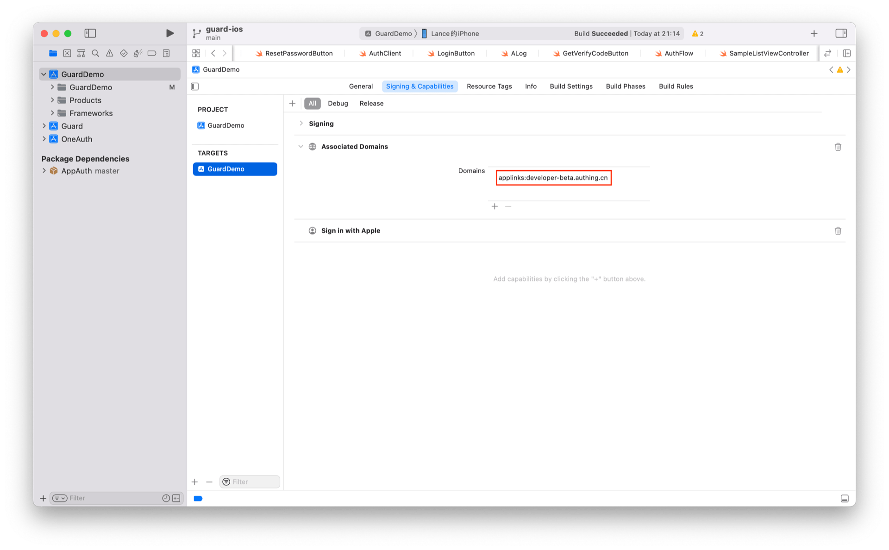

# QQ login

<LastUpdated/>

## Preparation

Configure in [QQ Internet](https://developer.baidu.com/) and [Authing Console](https://authing.cn/), please refer to [QQ access preparation](../. ./../guides/connections/social/qq-mobile/README.md), [QQ Connected iOS App](https://wiki.connect.qq.com/ios_sdk%e7%8e%af%e5%a2 %83%e6%90%ad%e5%bb%ba).

<br>

## Integrated QQ login

### Step 1: Add Tencent dependency

1. Enter: https://github.com/Authing/authing-binary in the swift package search bar.

2. Select [Authing-binary](https://github.com/Authing/authing-binary).
> [Authing-binary](https://github.com/Authing/authing-binary) depends on [Guard-iOS SDK](https://github.com/Authing/guard-ios).

3. Select **Up to Next Major Version 1.0.0** for the dependency rule.

4. Check **Tencent** after Add Package.

> **Tencent** depends on the version after [Guard-iOS 1.4.1](https://github.com/Authing/guard-ios).

<br>

### Step 2: Modify project configuration

Configure the bounce URL of the QQ login component:
1. Select the Xcode project, click the plus sign in **Targets** -> **Info** -> **URL Types**.
2. **Identifier** fill in tencentopenapi
3. **URL Schemes** fill in **tencent** + QQ interconnected **APP-ID**, for example: tencent102043018.
<br>

### Step 3: Add a whitelist to start WeChat in Info.plist

Open Info.plist via Source Code, then copy and paste the following code:

```xml
<plist version="1.0">
<dict>
     ...
     <key>LSApplicationQueriesSchemes</key>
<array>
         <string>tim</string>
<string>mqq</string>
<string>mqqapi</string>
<string>mqqbrowser</string>
<string>mttbrowser</string>
<string>mqqOpensdkSSoLogin</string>
<string>mqqopensdkapiV2</string>
<string>mqqopensdkapiV4</string>
<string>mqzone</string>
<string>mqzoneopensdk</string>
<string>mqzoneopensdkapi</string>
<string>mqzoneopensdkapi19</string>
<string>mqzoneopensdkapiV2</string>
<string>mqqapiwallet</string>
<string>mqqopensdkfriend</string>
<string>mqqopensdkavatar</string>
<string>mqqopensdkminiapp</string>
<string>mqqopensdkdataline</string>
<string>mqqgamebindinggroup</string>
<string>mqqopensdkgrouptribeshare</string>
<string>tencentapi.qq.reqContent</string>
<string>tencentapi.qzone.reqContent</string>
<string>mqqthirdappgroup</string>
<string>mqqopensdklaunchminiapp</string>
<string>mqqopensdkproxylogin</string>
<string>mqqopensdknopasteboard</string>
</array>
     ...
</dict>
</plist>
```

<br>

### Step 4: Set up Associated Domains:

> Fill in the host corresponding to the developer's Universal Link.



<br>

### Step 5: Initialize QQ login
```swift
import Guard
import Tencent

func application(_ application: UIApplication, didFinishLaunchingWithOptions launchOptions: [UIApplication.LaunchOptionsKey: Any]?) -> Bool {
     Authing.start(<#AUTHING_APP_ID#>)
     Tencent.register(appId: <#your_qq_appkey#>, universalLink: <#your_qq_universalLink#>)}
  ```

> universalLink Please fill in according to the requirements of QQ Internet.

<br>


### Step 6: Handle QQ login callback

After Weibo returns to the application, if SceneDelegate is used, the following functions need to be overloaded in SceneDelegate.swift:

```swift
func scene(_ scene: UIScene, continue userActivity: NSUserActivity) {
     if let url = userActivity. webpageURL {
         _ = Tencent. handleUniversalLink(url: url)
     }
}

func scene(_ scene: UIScene, openURLContexts URLContexts: Set<UIOpenURLContext>) {
     _ = Tencent. handleURL(url: url)
}
```

If SceneDelegate is not used, it needs to be overloaded in AppDelegate:

```swift
func application(_ application: UIApplication, continue userActivity: NSUserActivity, restorationHandler: @escaping ([UIUserActivityRestoring]?) -> Void) -> Bool {
     if let url = userActivity. webpageURL {
         return Tencent.handleUniversalLink(url: url)
     }
}

func application(_ app: UIApplication, open url: URL, options: [UIApplication. OpenURLOptionsKey : Any] = [:]) -> Bool {
     return Tencent. handleURL(url: url)
}
```

<br>

### Step 7: Initiate QQ login authorization
#### QQ authorized login

```swift
func login(completion: @escaping Authing.AuthCompletion) -> Void
```

**example**

```swift
Tencent.login { code, message, userInfo in
     if (code == 200) {
         // login successful
         // userInfo
     }
}
```

<br>

If the developer integrates QQ login by himself, after getting the accessToken, he can call the following API in exchange for Authing user information:

#### Login via QQ authorization code

```swift
func loginByTencent(_ accessToken: String, completion: @escaping(Int, String?, UserInfo?) -> Void)
```

**parameter**

`accessToken` QQ accessToken

**example**

```swift
AuthClient().loginByTencent(accessToken) { code, message, userInfo in
     if (code == 200) {
         // userInfo: user information
     }
}
```