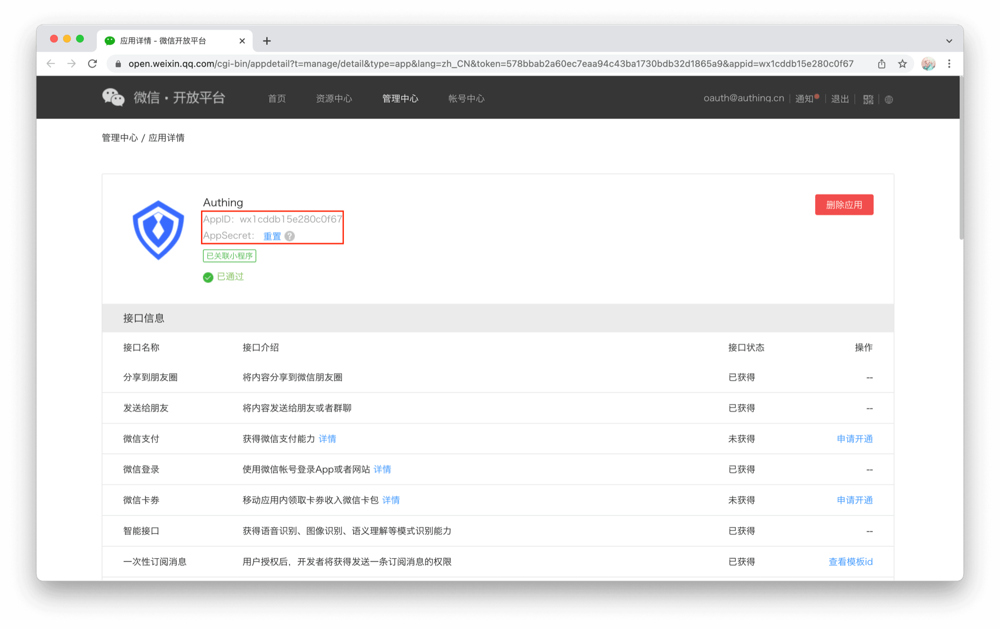
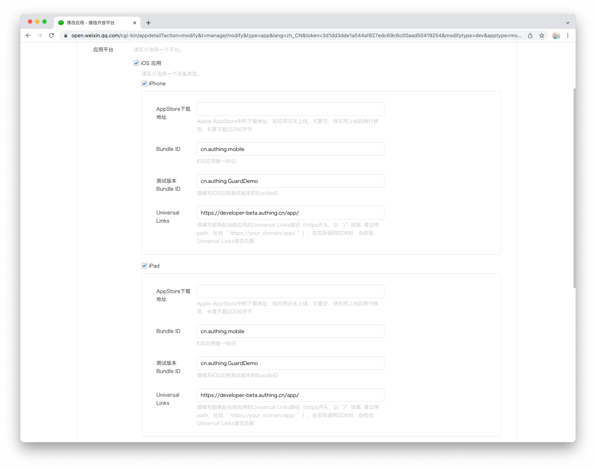
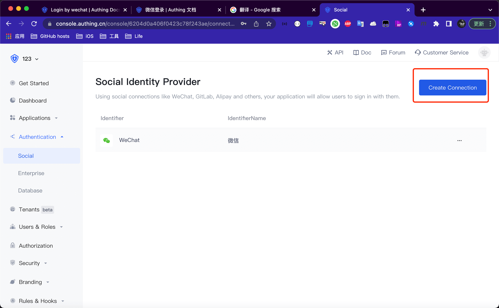
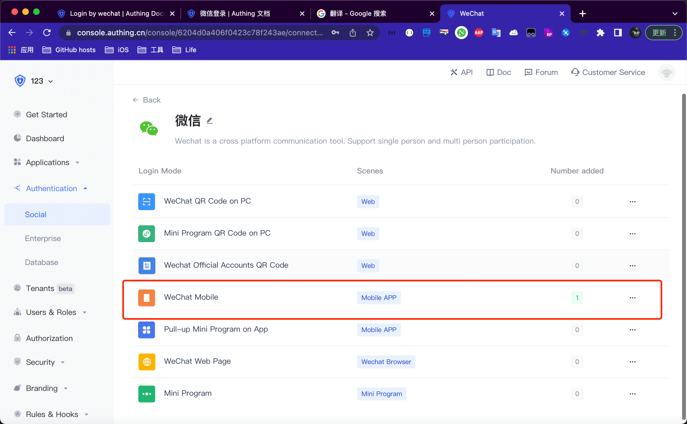
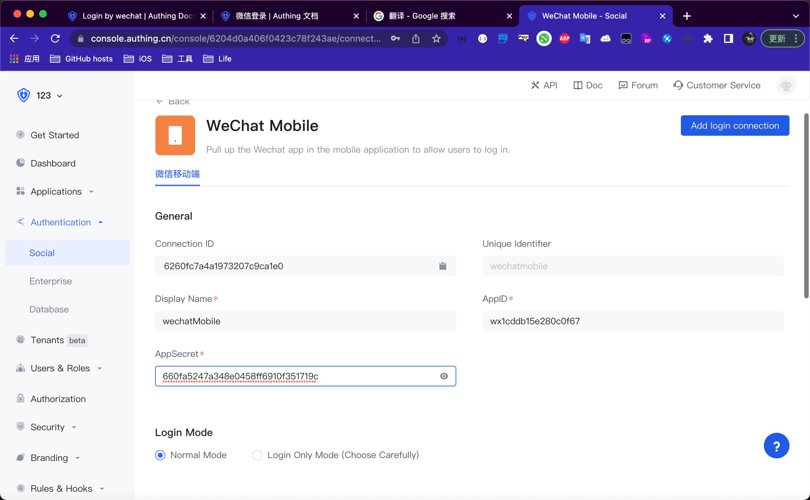

# Login by wechat

<LastUpdated/>

There are three major steps:
* Configurations on wechat open platform
* Steps at Authing console
* Integrate Authing iOS SDK
<br>

## Configurations on [Wechat open platform](https://open.weixin.qq.com/)

>Note: Developer must be verified before using any service on wechat open platform. Wechat doesn't support personal usage, so developer must be part of some organization, commercial or governmental. And It costs 300 RMB to become a verified developer.

1. Get wechat AppID and AppSecret



2. Setup iOS information



Wechat requires a callback through [Universal Links](https://developer.apple.com/ios/universal-links/)

<br>

## Steps at Authing console:

1. Click 'Authentication' on the left sidebar and choose 'Social', then click 'Wechat'



2. In the list select 'Wechat Mobile'



3. Set an ID for this connection. It can be anything as long as being unique across Authing's connections.

4. Enter your wechat AppID and AppSecret


6. Hit 'Save' and we are all set

<br>

## Integrate iOS SDK

### Initialize Guard SDK

> Guard-iOS-binary depends on the Guard component (after Version 1.2.4)

- in the swift package search bar enter: https://github.com/Authing/authing-binary

- Dependency rule Select Up to Next Major Version 1.0.0

- Add Package Then select Wechat

<br>

### Add start WeChat whitelist in Info.plist

key: LSApplicationQueriesSchemes

value: weixin, weixinULAPI


You can also open Info.plist through Source Code, and then copy and paste the following code:

```xml
<plist version="1.0">
<dict>
    ...
    <key>LSApplicationQueriesSchemes</key>
	<array>
		<string>weixin</string>
		<string>weixinULAPI</string>
	</array>
    ...
</dict>
</plist>
```

<br>

### To set up WeChat when the App starts:

```swift
import Guard
import Wechat
Authing.start(<#Authing AppId#>);
WechatLogin.registerApp(appId: <#your_wechat_appid#>, universalLink: <#your_deep_link#>)
 ```
The first parameter is the WeChat App id; the second parameter is iOS [Universal Link](https://developer.apple.com/ios/universal-links/)

<br>

### Set Associated Domains：

> Replace with the host corresponding to your Universal Link


<br>

## Handling Wechat Callbacks

After Alipay returns to the application, if SceneDelegate is used, you need to overload the following functions in SceneDelegate.swift:

```swift
func scene(_ scene: UIScene, continue userActivity: NSUserActivity) {
    NotificationCenter.default.post(name: NSNotification.Name(rawValue: "wechatLoginOK"), object: userActivity)
}
```

If SceneDelegate is not used, you need to be overloaded in AppDelegate

```swift
func application(_ application: UIApplication, continue userActivity: NSUserActivity, restorationHandler: @escaping ([UIUserActivityRestoring]?) -> Void) -> Bool {
    NotificationCenter.default.post(name: NSNotification.Name(rawValue: "wechatLoginOK"), object: userActivity)
    return true
}
```

<br>

### Initiate wechat authorization

With the semantic Hyper Component we provide, you only need to place one in the xib:

```swift
WechatLoginButton
```

In case you don't want to use our UI component, you can have your own Button, and then inside your Button's onClick event, you can start wechat authentication and handle callback event like this:

```swift
// context is optional Parameters
WechatLogin.login(viewController: <#AuthViewController#>, "context") { code, message, userInfo in
    if (code == 200) {
        // login successful
        // userInfo
    } else if (code == 1640) {
        // Only an existing account can be bound
        // userInfo.socialBindingData return method(login method) and key(intermediate state key)
    } else if (code == 1641) {
        // Allows you to bind existing accounts or create new accounts
        // userInfo.socialBindingData return method(login method) and key(intermediate state key)
    } else if (code == 2921) {
        // Select multiple accounts and bind them
        // userInfo.socialBindingData return accounts(account list) and key(intermediate state key)
    }
}
```

If you want to obtain only wechat authorization code:
```swift
WechatLogin.getAuthCode(viewController: <#AuthViewController#>) { authCode in
    // authCode: wechat authorization code
}
` ` `

If you want to implement the whole process by your own, right after you get auth code, please call this API to get Authing user info:

```swift
func getDataByWechatlogin(authData: AuthRequest? = nil, code: String, _ context: String? = nil, completion: @escaping(Int, String?, UserInfo?) -> Void)
``` 
**Parameter**

* *code* wechat auth code
* `context` Request context, set here `context` you can get [pipeline context](/guides/pipeline/context-object.md) .

**Example**
```swift
AuthClient().getDataByWechatlogin(code: "Wechat auth code") { code, message, userInfo in
    if (code == 200) {
        // login successful
        // userInfo
    } else if (code == 1640) {
        // Only an existing account can be bound
        // userInfo.socialBindingData return method(login method) and key(intermediate state key)
    } else if (code == 1641) {
        // Allows you to bind existing accounts or create new accounts
        // userInfo.socialBindingData return method(login method) and key(intermediate state key)
    } else if (code == 2921) {
        // Select multiple accounts and bind them
        // userInfo.socialBindingData return accounts(account list) 以及 key(intermediate state key)
    }
}
```

<br>