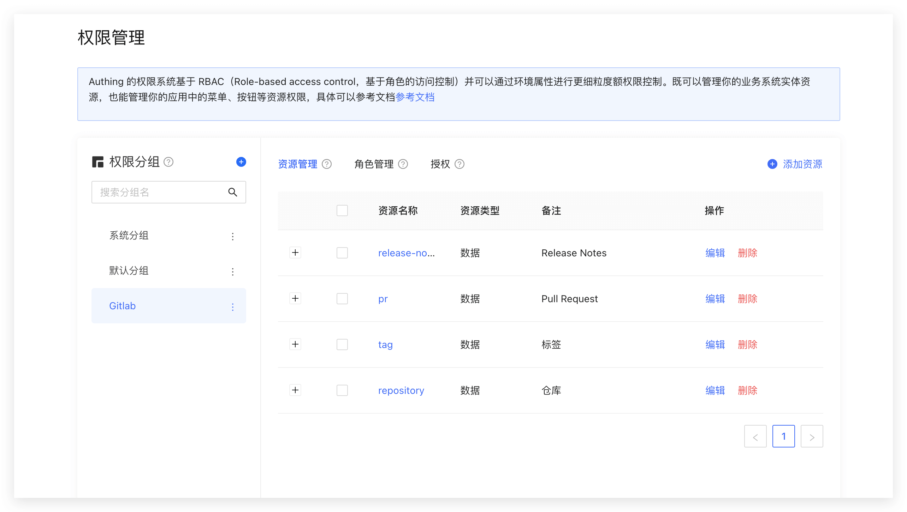

# 选择合适的权限模型

<LastUpdated/>

目前被大家广泛采用的两种权限模型为：[基于角色的访问控制（RBAC）](#什么是基于角色的访问控制-rbac)和[基于属性的访问控制（ABAC）](#什么是基于属性的访问控制-abac)，二者各有优劣：RBAC 模型构建起来更加简单，缺点在于无法做到对资源细粒度地授权（都是授权某一类资源而不是授权某一个具体的资源）；ABAC 模型构建相对比较复杂，学习成本比较高，优点在于细粒度和根据上下文动态执行。

## 什么是基于角色的访问控制（RBAC）

基于角色的访问控制（Role-based access control，简称 RBAC），指的是通过用户的角色（Role）授权其相关权限，这实现了更灵活的访问控制，相比直接授予用户权限，要更加简单、高效、可扩展。

当使用 RBAC 时，通过分析系统用户的实际情况，基于共同的职责和需求，授予他们不同角色。你可以授予给用户一个或多个角色，每个角色具有一个或多个权限，这种 用户-角色、角色-权限 间的关系，让我们可以不用再单独管理单个用户，用户从授予的角色里面继承所需的权限。

以一个简单的场景（Gitlab 的权限系统）为例，用户系统中有 Admin、Maintainer、Operator 三种角色，这三种角色分别具备不同的权限，比如只有  Admin 具备创建代码仓库、删除代码仓库的权限，其他的角色都不具备。

我们授予某个用户「Admin」这个角色，他就具备了「创建代码仓库」和「删除代码仓库」这两个权限。

不直接给用户授权策略，是为了之后的扩展性考虑。比如存在多个用户拥有相同的权限，在分配的时候就要分别为这几个用户指定相同的权限，修改时也要为这几个用户的权限进行一一修改。有了角色后，我们只需要为该角色制定好权限后，给不同的用户分配不同的角色，后续只需要修改角色的权限，就能自动修改角色内所有用户的权限。

## 什么是基于属性的访问控制（ABAC）

基于属性的访问控制（Attribute-Based Access Control，简称 ABAC）是一种非常灵活的授权模型，不同于 RBAC，ABAC 则是通过各种属性来动态判断一个操作是否可以被允许。

### ABAC 的主要组成部分

在 ABAC 中，一个操作是否被允许是基于对象、资源、操作和环境信息共同动态计算决定的。

- 对象：对象是当前请求访问资源的用户。用户的属性包括ID，个人资源，角色，部门和组织成员身份等；
- 资源：资源是当前访问用户要访问的资产或对象（例如文件，数据，服务器，甚至API）。资源属性包含文件的创建日期，文件所有者，文件名和类型以及数据敏感性等等；
- 操作：操作是用户试图对资源进行的操作。常见的操作包括“读取”，“写入”，“编辑”，“复制”和“删除”；
- 环境：环境是每个访问请求的上下文。环境属性包含访问尝试的时间和位置，对象的设备，通信协议和加密强度等。

### ABAC 如何使用属性动态计算出决策结果

在 ABAC 的决策语句的执行过程中，决策引擎会根据定义好的决策语句，结合对象、资源、操作、环境等因素动态计算出决策结果。、

每当发生访问请求时，ABAC 决策系统都会分析属性值是否与已建立的策略匹配。如果有匹配的策略，访问请求就会被通过。

例如，策略「当一个文档的所属部门跟用户的部门相同时，用户可以访问这个文档」会被以下属性匹配：

- 对象（用户）的部门 = 资源的所属部门；
- 资源 = “文档”；
- 操作 = “访问”；

策略「早上九点前禁止 A 部门的人访问B系统；」会被以下属性匹配：

- 对象的部门 = A 部门；
- 资源 = “B 系统”；
- 操作 = “访问”；
- 环境 = “时间是早上 9 点”。

### ABAC 应用场景

在 ABAC 权限模型下，你可以轻松地实现以下权限控制逻辑：

1. 授权编辑 A 具体某本书的编辑权限；
2. 当一个文档的所属部门跟用户的部门相同时，用户可以访问这个文档；
3. 当用户是一个文档的拥有者并且文档的状态是草稿，用户可以编辑这个文档；
4. 早上九点前禁止 A 部门的人访问 B 系统；
5. 在除了上海以外的地方禁止以管理员身份访问 A 系统；

上述的逻辑中有几个共同点：

- 具体到某一个而不是某一类资源；
- 具体到某一个操作；
- 能通过请求的上下文（如时间、地理位置、资源 Tag）动态执行策略；

如果浓缩到一句话，你可以**细粒度地授权在何种情况下对某个资源具备某个特定的权限。**

## {{$localeConfig.brandName}} 的权限模型

在 {{$localeConfig.brandName}} 中有几个概念：
- 用户：你的终端用户；
- 角色：角色是一个逻辑集合，你可以授权一个角色某些操作权限，然后将角色授予给用户，该用户将会继承这个角色中的所有权限；
- 资源：你可以把你应用系统中的实体对象定义为资源，比如订单、商品、文档、书籍等等，每种资源都可以定义多个操作，比如文档有阅读、编辑、删除操作；
- 授权：把某类（个）资源的某些（个）操作授权给角色或者用户。

在 {{$localeConfig.brandName}} 的权限系统中，我们通过用户、角色这两种对象实现了 RBAC 模型的角色权限继承，在此之上，我们还能围绕属性进行动态地、细粒度地授权，从而实现了 ABAC 权限模型。同时，我们为了满足大型系统中复杂组织架构的设计需求，将资源、角色、权限授权统一组合到一个[权限分组](./resource-group.md)中，方便开发者进行管理。

## 我该如何选择使用哪种权限模型

在这里，组织的规模是至关重要的因素。由于 ABAC 最初的设计和实施困难，对于小型企业而言，考虑起来可能太复杂了。

对于中小型企业，RBAC 是 ABAC 的简单替代方案。每个用户都有一个唯一的角色，并具有相应的权限和限制。当用户转移到新角色时，其权限将更改为新职位的权限。这意味着，在明确定义角色的层次结构中，可以轻松管理少量内部和外部用户。

但是，当必须手动建立新角色时，对于大型组织而言，效率不高。一旦定义了属性和规则，当用户和利益相关者众多时，ABAC 的策略就更容易应用，同时还降低了安全风险。

简而言之，如果满足以下条件，请选择 ABAC：

- 你在一个拥有许多用户的大型组织中；
- 你需要深入的特定访问控制功能；
- 你有时间投资远距离的模型；
- 你需要确保隐私和安全合规；

但是，如果满足以下条件，请考虑 RBAC：

- 你所在的是中小型企业；
- 你的访问控制策略广泛；
- 你的外部用户很少，并且你的组织角色得到了明确定义；

## 接下来

接下来，你可以了解如何[集成 RBAC 权限模型到你的应用系统](./rbac.md)或者[集成 ABAC 权限模型到你的应用系统](./abac.md)。