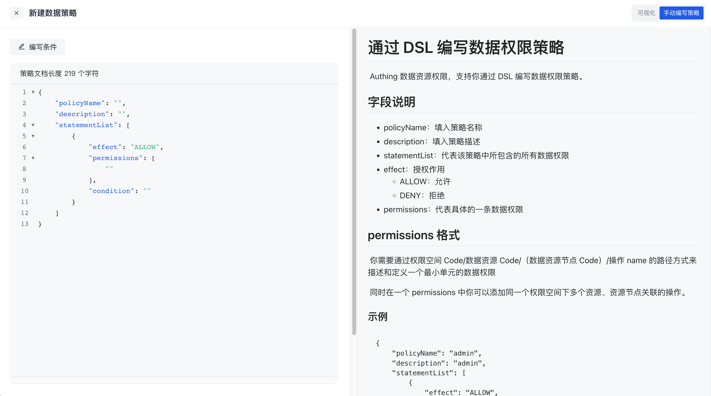
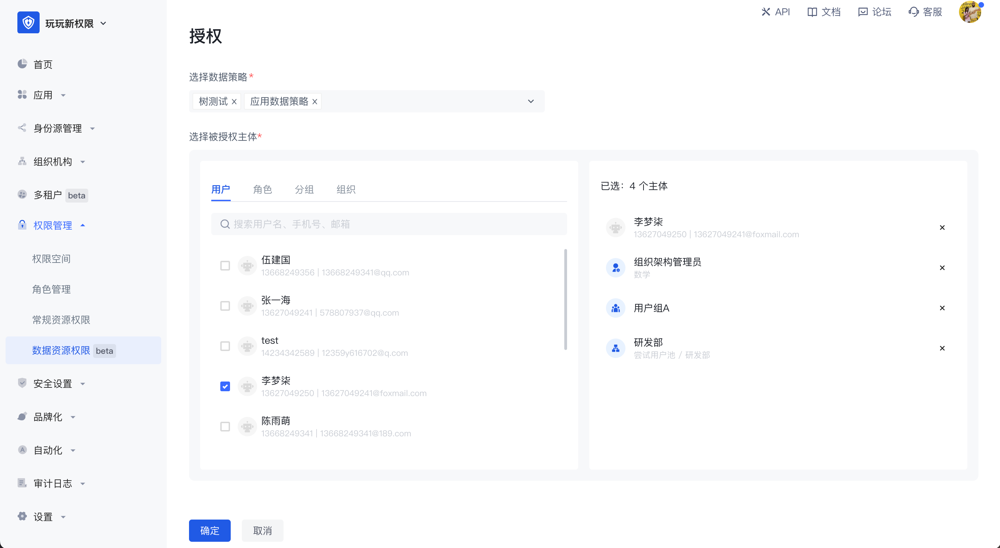

# 数据策略与授权

## 数据策略

数据策略：把若干个资源、操作、授权作用和限制条件打包在一起，叫做一个策略。

在数据策略列表中，可以查看所有数据策略授权主体和关联数据资源，并支持对数据策略进行新增、编辑修改和删除。

在新建数据策略时，有两种编辑方式：

- 可视化编辑策略

  一个策略中可以有多个数据权限，每一个数据权限都需要先选择授权作用，然后再选择权限空间中的资源及关联操作，在此基础上还可以添加权限限制条件，最终将资源打包到一起形成一个数据策略。

  在数据策略中支持跨权限空间选择资源。如果资源是树结构的数据资源，选择粒度细化，也可以选择某个层级的节点。

  

- 手动编写策略

  切换右上角的手动编写策略，可以通过 DSL 编写数据权限策略。

  

  点击左上角的编写条件，还支持通过 rego 语言编写数据权限策略中的条件。详见[数据策略与 OPA](链接地址)

## 授权

策略打包好后，点击权限管理页面右上角的 **授权** 按钮，将其授权给某个主体，可以将一个或多个数据策略同时授权给多个跨不同类型的授权主体。

