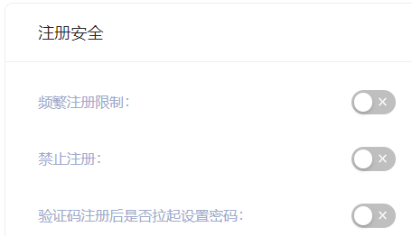
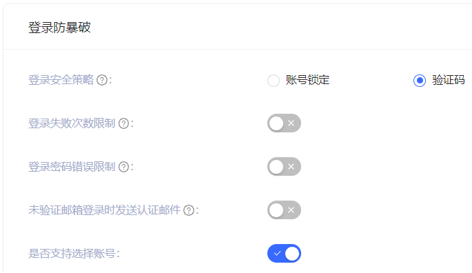
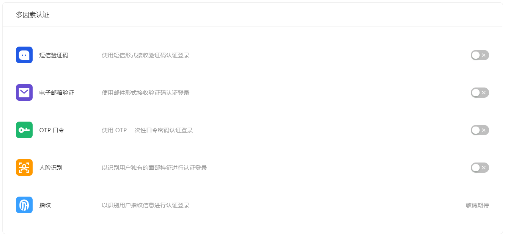

# 安全管理​
​
<LastUpdated/>

路径：**应用->自建应用->应用详情->安全管理**​

本章节介绍了和 cookie 过期时间、注册安全、登录安全、APP 扫码登录 Web 安全、多因素认证等安全相关配置项。

::: hint-info
* 应用中 **安全管理** 选项卡默认是关闭的。此时，应用的安全管理相关配置将由全局安全管理配置控制。要对单一应用进行单独的安全性配置，可以在 **高级配置->自定义配置** 中开启 **自定义本应用的安全规则** 开关。

* 在开启 **自定义本应用的安全规则** 开关的情况下，当前应用的安全规则将会继承当前全局安全管理（**安全设置**）中的配置。开启之后，管理员对此自建应用的安全规则配置将会独立于全局安全规则中的配置（包括通用安全、[密码安全](../../security/pw-security.md) 及 [多因素认证](../../security/mfa/README.md)。
:::

开启 **自定义本应用的安全规则** 开关后，你可以对本应用进行以下相关功能的配置：

## 基础安全

用户可在此模块指定登录状态的有效时间（即 **cookie 过期时间**）：

|选项|说明|
|----|----|
|浏览器会话|当前浏览器关闭后立即过期，下次打开需重新登录。|
|自定义过期时间|可在右侧输入框指定过期时间，建议 1209600 秒（14 天），过期后用户需要重新登录。 **注意**：对于应用面板及已加入应用面板的应用，将使用全局 **安全管理** 中设置的 cookie 过期时间。|

## 注册安全

|开关|说明|
|----|----|
|频繁注册限制|管理员可以通过指定 **限定周期时间** 和 **周期内限定频次** 限制同一个 IP 在多少秒内不能超过多少次注册。|
|禁止注册|开启该开关后，普通用户将无法通过登录框或者 API 注册，只有管理员可以手动创建账号。|

## 登录防暴破

{{$localeConfig.brandName}} 为 **账号锁定** 和 **图形验证码** 两种场景提供登录安全策略。

### 账号锁定

|开关|说明|
|----|----|
|登录密码错误限制|当用户登录输入密码错误时，会按照登录安全策略规则触发相对应的策略。开启 **登录密码错误限制** 开关，可以通过指定 **限定周期时间** 和**周期内限定频次** 限制同一账号在多少秒内不能超过多少次密码输入错误。若在规定时间内超过次数后，该用户再次登录时，需要输入图形验证码。|
|未验证邮箱登录时发送认证邮件|开启后，如果用户使用未经过验证的邮箱登录，{{$localeConfig.brandName}} 将向该邮箱发送一封验证邮件，用户需要前往此邮箱点击认证链接后方可完成登录。|

### 图形验证码

除了上述 **账号锁定** 场景的两个策略，**图形验证码** 还可以定义 **登录失败次数限制**：当用户登录信息输入错误时，会按照登录安全策略规则触发相对应的策略。开启 **登录失败次数限制** 开关，可以通过指定 **限定周期时间** 和**周期内限定频次** 限制同一账号在多少秒内不能超过多少次失败登录。若在规定时间内超过次数后，该用户再次登录时，需要输入图形验证码。

## APP 扫码登录 Web 安全

{{$localeConfig.brandName}} 一直以来都致力于带给开发者高度自定义的开发体验，所以我们提供以下自定义配置项，开发者可以根据自己业务的需要，在安全性和便捷性之间权衡。

|字段 / 开关|说明|
|----|----|
|二维码有效时间|默认 120s。|
|ticket 有效时间|默认 300s。|
|Web 轮询接口返回完整用户信息|默认不返回。由于查询二维码状态接口是没有权限校验的，这意味着直接在此接口返回用户信息（包含登录凭证 token）是存在安全隐患的，所以我们推荐开发者遵循最佳实践：查询二维码状态接口只返回用户昵称和头像，使用 ticket 换取用户信息。|
|允许在浏览器使用 ticket 换取用户信息|默认不允许，需要在服务器端调用，即需要使用用户池密钥初始化之后。[点击了解如何初始化后端 SDK](/reference/sdk-for-node/README.md)。一个典型的使用场景是：用户扫码同意授权、开发者得到 ticket 之后，发送到自己的后端，使用后端 SDK 换取用户信息，之后重定向到已登录页面，同时将用户信息写入 localStroage。|

## 多因素认证

多因素认证（Multi Factor Authentication，简称 MFA）是一种非常简单的安全实践方法，能够在用户名称和密码之外再额外增加一层保护。启用 MFA 后，用户登录时，除了需要提供用户名和密码外（第一次身份验证），还需要进行第二次身份验证，多因素身份认证结合起来将为你的帐号和资源提供更高的安全保护。你可以在此了解[什么是多因素认证](/concepts/mfa.md)。
 
你可以如下图所示为你的应用开启 MFA：

更多详情，请参阅 [多因素认证综述](/guides/security/mfa/)。