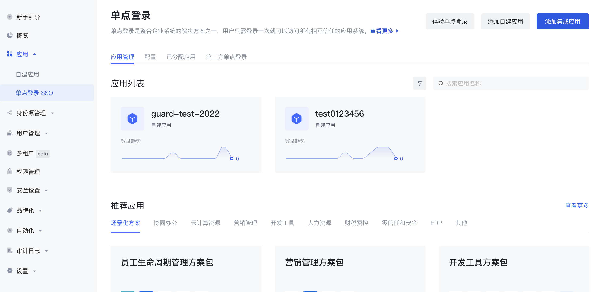
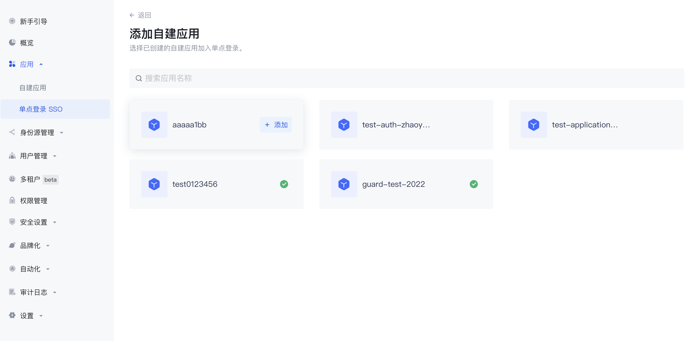
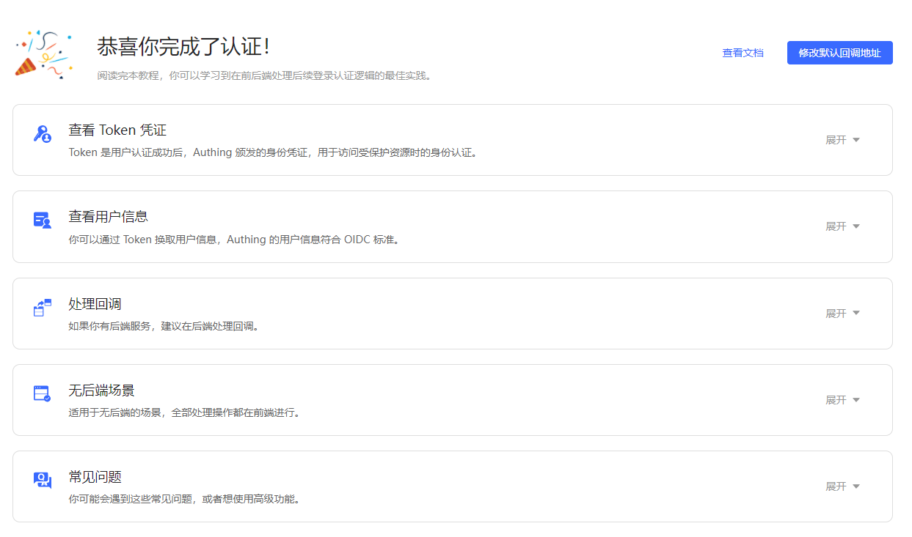

# 自建应用 SSO 方案

<LastUpdated/>

{{$localeConfig.brandName}} 把应用分为自建应用和集成应用。用户池存储了用户系统中所有的用户数据，而自建应用则对应的是现实中根据业务需求创建的业务应用。一个用户池可能会有多个自建应用。开启应用之间的单点登录后，同一个用户池下的不同应用之间的登录状态将会打通，终端用户只需登录一次即可在不同的应用之间畅行。

## 在 {{$localeConfig.brandName}} 控制台配置单点登录

### 第一步：创建两个应用

首先你可以按照 [指引](/guides/app-new/create-app/create-app.md) 创建两个应用。

### 第二步：配置单点登录

1. 进入菜单 **应用->单点登录 SSO**，点击右上角 **添加自建应用**。

<!-- 分别进入这两个应用的配置页面，选择**登录控制**标签页，开启多域名单点登录开关。 -->

2. 在列表中找到并添加已创建的应用。

### 第三步：体验应用单点登录

1. 进入 **单点登录 SSO** 的 **应用列表** 标签，选择一个应用，点击 **体验登录**。

2. 在登录页面完成登录。

成功后会跳转到应用回调地址：

3. 接下来我们点击另一个应用的体验按钮。

用户无需再次输入密码，直接进入了该应用的回调地址：

## 使用 SDK 接入单点登录

详细的接入流程请见 [单点登录 SDK](/reference/sdk-for-sso-spa.md) 文档。
