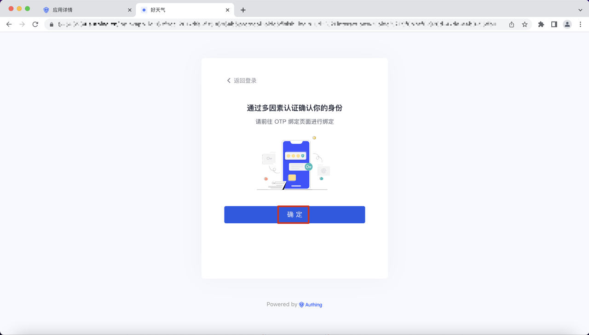
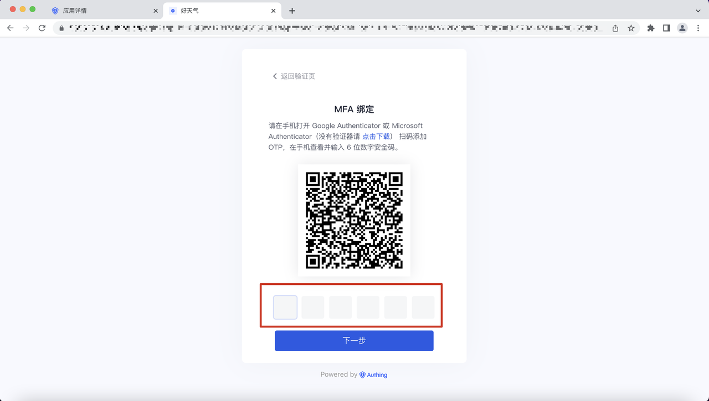
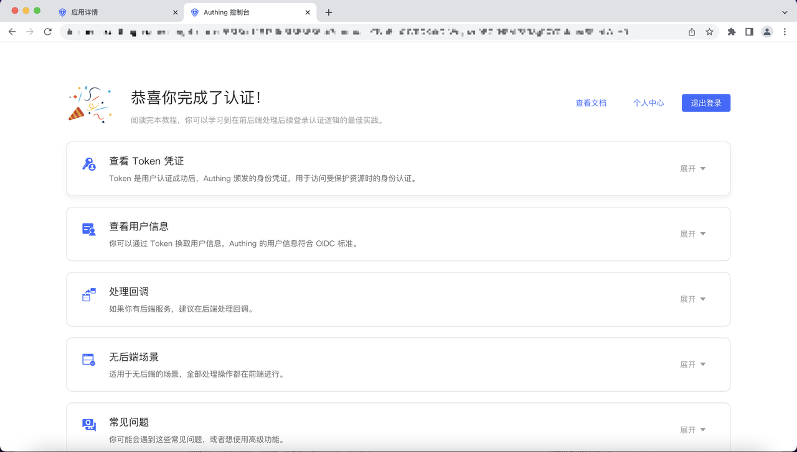
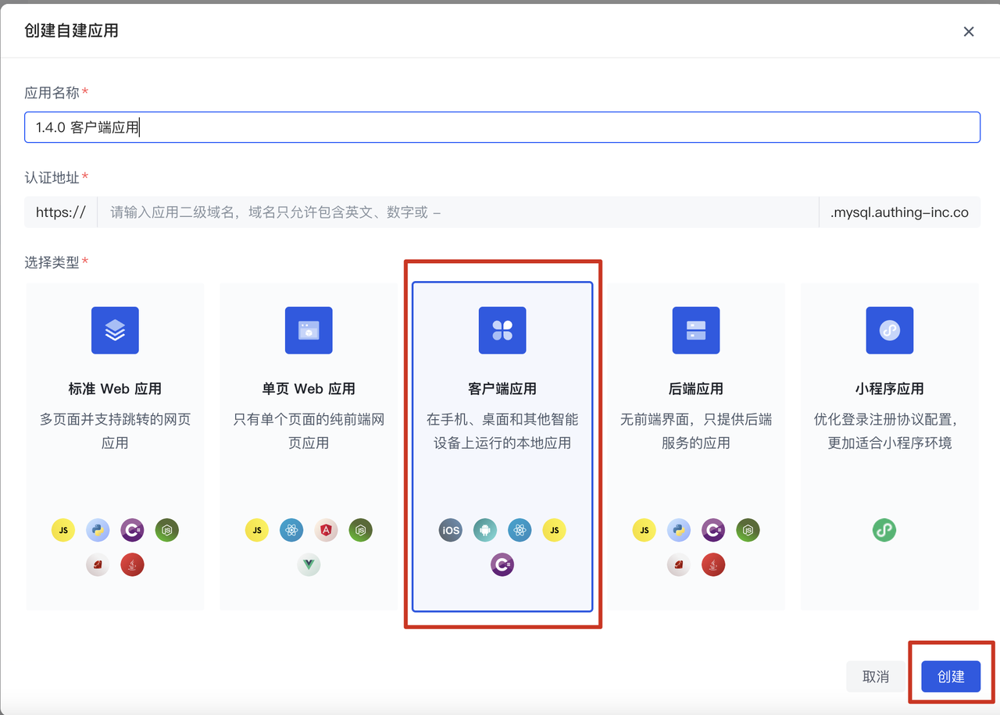
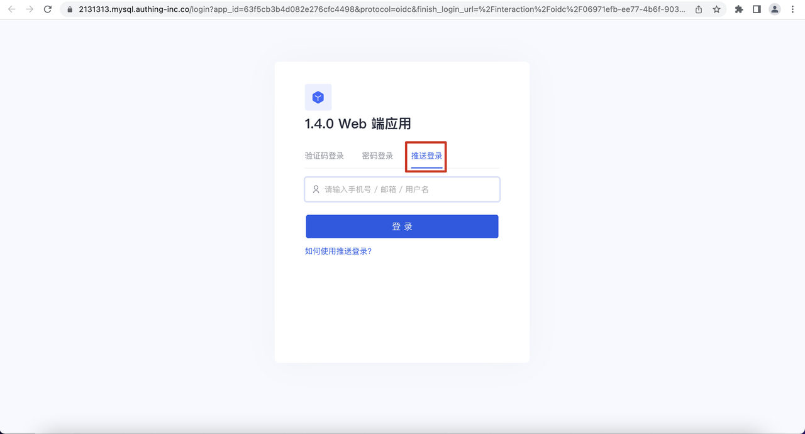
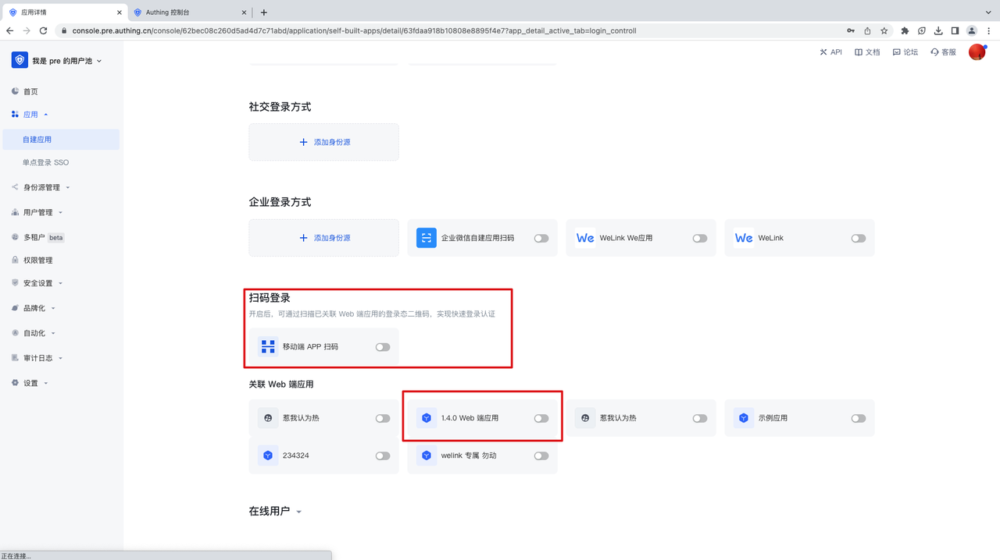
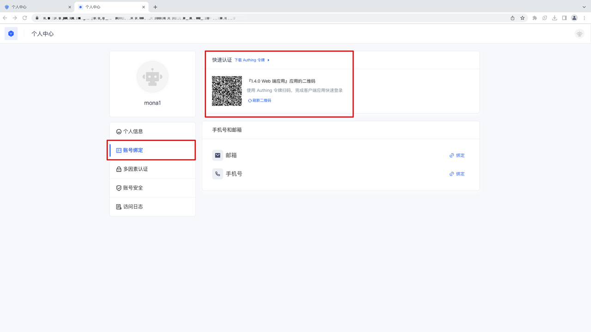

# Authing 令牌

<LastUpdated />

## Authing 令牌介绍

- Authing 令牌是北京蒸汽记忆科技有限公司针对手机设备开发的认证、登录及授权的工具型应用。目前支持 iOS 及 Android 系统，它是 Authing 云原生身份管理产品的重要组成部分。该产品具备以下核心功能：
  - OTP 口令录入/读取/认证 - 为账号绑定 OTP 口令，随时对应用提供认证及登录能力；；
  - Authing 客户端应用注册/登录能力- 绑定 & 体验登录 Authing 控制台客户端应用及 Guard，并查看用户信息；
  - 生物认证登录方式 - 支持系统、设备级别的指纹识别及人脸识别能力；
  - 免密快速登录认证 Web 端应用- 移动端推送登录认证、扫码登录认证 Web 端应用；
  - 免密快速登录认证客户端应用 - 移动端应用扫码 Web 端具有登录态的二维码（目前位于应用个人中心），完成移动端的快速登录认证；

## 前置准备工作

- 下载 「Authing 令牌」到手机：
  - iOS 下载地址：[https://apps.apple.com/app/authing-令牌/id1603744061](https://apps.apple.com/app/authing-令牌/id1603744061)
  - 安卓下载地址：[https://mobile.baidu.com/item?docid=5000565464&source=appbaidu](https://mobile.baidu.com/item?docid=5000565464&source=appbaidu)
- 注册并登录成为 Authing Console 控制台开发者：  
  Authing Console 开发者注册 / 登录地址：[https://console.authing.cn](https://console.authing.cn/)

## 功能 1：OTP 口令录入/读取/认证；

Authing 为账号提供多因素认证能力，为账号绑定 OTP ，随时对 Web 应用提供认证及登录能力；

步骤 1: 在 Authing Console 控制台，创建一个 Web 端应用：

步骤 2: 进入到刚刚创建的 Web 端应用，打开「高级配置」-「安全设置」模块：

步骤 3: 在「安全管理」模块，找到「多因素认证」，开启「 OTP 口令」认证方式：

步骤 4: 在刚刚创建的 Web 端应用中， 点击「体验登录」并且输入该用户池的用户账号信息，点击「登录」button：

步骤 5: 此时该应用登录框提示，需要进行 OTP 绑定，点击确定，进入到绑定流程：

步骤 6: 打开「Authing 令牌」，扫描以下二维码，绑定相关的账户；

<video controls>
  <source src="./bind-account.mp4" type="video/mp4">
</video>

步骤 7: 点击「完成绑定」，即可进入到该应用的页面里：

以上示例简单的描述了一次在 Authing 应用里面使用「 Authing 令牌」完成口令认证的一个流程，Authing 令牌适用于市面上所有的标准化 OTP 口令录入、读取及认证；

## 功能 2：Authing 客户端应用注册/登录能力

Authing 令牌支持绑定控制台客户端应用，并体验登录 Guard 能力；

步骤 1: 在 Authing Console 控制台，创建一个客户端应用：

步骤 2: 在 Authing 控制台，客户端应用的「登录控制」下面，找到该应用的二维码：

步骤 3: 打开 Authing 令牌，进入「我的」 Tab，点击 「添加应用」-「扫码二维码」，即可进入该应用的 Guard 界面：

<video controls>
  <source src="./scan-qrcode.mp4" type="video/mp4">
</video>

步骤 4: 在 Authing 控制台，客户端应用的登录控制下面，配置相关的登录方式：

步骤 5: 打开 Authing 令牌，进入「我的」 Tab，点击体验登录某个应用，选择相应的登录方式，即可进入该应用的 个人中心：

<video controls>
  <source src="./personal-center.mp4" type="video/mp4">
</video>

## 功能 3: 生物认证登录方式（指纹、人脸识别）

目前安卓设备支持设备指纹识别，iOS 支持设备人脸识别：

步骤 1 : 在 Authing 控制台，客户端应用的登录控制下面，开启/关闭相应的生物认证能力：

步骤 2: 打开 Authing 令牌，找到该客户端应用，点击该应用，进入到 Guard， 使用生物认证能力进行登录：

安卓指纹登录体验：

<video controls>
  <source src="./webauthn-test.mp4" type="video/mp4">
</video>

iOS 指纹登录体验：

<video controls>
  <source src="./iOSWebauthn.mp4" type="video/mp4">
</video>

安卓指纹绑定/解绑：

<video controls>
  <source src="./bind-finger.mp4" type="video/mp4">
</video>

iOS 人脸识别 绑定/解绑：

<video controls>
  <source src="./bind-face.mp4" type="video/mp4">
</video>

## 功能 4: 免密快速登录认证 Web 端应用

该功能支持在同一个用户池下，客户端应用用户处于登录态情况时，可以通过接收 Push notification，实现 Web 端应用的快速登录认证；

步骤 1 : 在 Authing 控制台，创建一个 Web 端应用：

步骤 2 : 开启免密登录认证下的 推送登录认证，同时选择可认证的客户端应用；

步骤 3 : 点击体验登录，进入到该应用的体验登录 Guard 界面：

步骤 4 : 输入用户名并点击登录，系统会自动给 Authing 令牌发送一条确认登录的消息通知；

<video controls>
  <source src="./test-push.mp4" type="video/mp4">
</video>

步骤 5 : 打开 Authing 令牌，当该设备及应用上有关联的应用处于登录的状态，就会收到一条 PUSH 消息，点击确认登录， Web 端的应用就会跳到登录后界面；同时，当该应用不处于后台运行的状态下，会在站外收到一条 PUSH 消息，点击进入应用后，确认登录，也可以进入到确认登录界面：

<video controls>
  <source src="./click-push.mp4" type="video/mp4">
</video>

## 功能 5: 免密快速登录认证客户端应用

步骤 1 : 打开刚刚创建好的客户端应用，开启 移动端 APP 扫码的登录方式及相关联的应用；

步骤 2 : 进入到 1.4.0 Web 端应用的个人中心，点击账号绑定，查看快速认证的二维码：

步骤 3 : 拿出 Authing 令牌，进入 「我的」-「添加应用」-「扫描二维码」入口，扫描以上二维码，完成移动端应用快速登录，进入到个人中心：

<video controls>
  <source src="./verify-qrcode.mp4" type="video/mp4">
</video>
