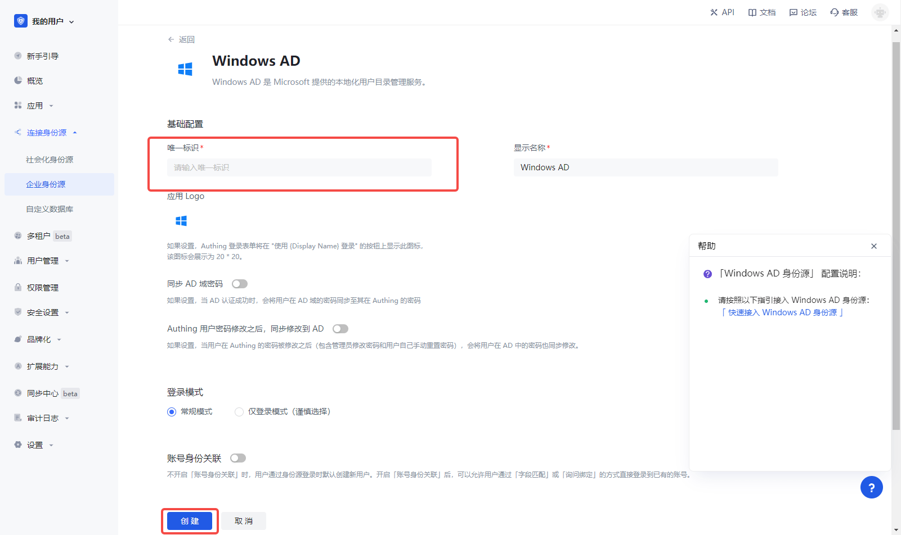
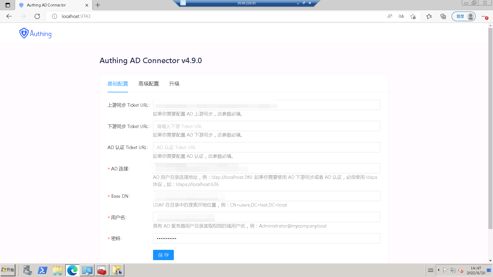
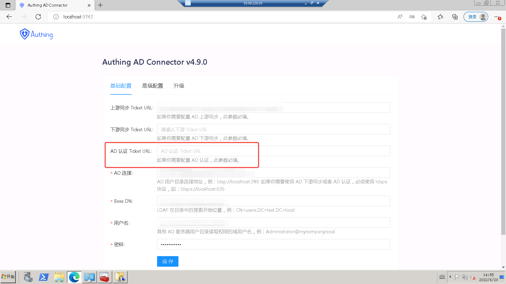

# Windows AD

<LastUpdated/>

## 场景介绍

- **概述**：Windows AD 是 Microsoft 提供的本地化用户目录管理服务。在 {{$localeConfig.brandName}}中配置并开启 Windows AD 服务商应用扫码 的企业登录，即可实现通过 {{$localeConfig.brandName}}快速获取 Windows AD 基本开放的信息和帮助用户实现免密登录功能。
- **应用场景**：企业 PC 免登场景
- **终端用户预览图**：

## 注意事项：

- 使用 Windows AD 你需要 Windows 服务器；
- 服务器安装了 Active Directory；
- 运行 Authing AD Connector 的机器上，能够连通 Active Directory；
- 一个具有 Active Directory 的读取权限的用户账密。
- 如果您未开通 {{$localeConfig.brandName}}控制台账号，请先前往 [ {{$localeConfig.brandName}}Console 控制台](https://authing.cn/) 注册开发者账号；

## 本章节包含以下内容：

- **Windows Active Directory** 在 Windows Server 下的安装
- 安装 **AD LDS**
- 配置 **AD 域服务**
- 检查 **Active Directory** 服务连接
- 安装 **AD CS**
- 配置 **AD CS**
- 测试通过 **`ldaps`** 连接 Active Directory
- **`AD 相关策略`** 的 `修改` 与 `测试`
- 相关 **`服务`** 以及 **`配置`** 的目的

## Windows Active Directory 在 Windows Server 下的安装

### 安装 **AD 域服务**

1. 打开 Windows Server 中的 `服务管理器`

2. 选择 `添加角色和功能`

3. 选择 `安装类型`

4. `服务器选择`

5. 选择 `服务器角色`

6. 选择 `功能`

7. 确认

8. AD LDS

9. 安装中

10. 安装成功

### 安装 **AD LDS**

> **AD LDS** 并不是必须要安装的，您也可以选择不进行安装，直接进行 **`配置 AD 域服务`** 的安装， 此处只是提供安装过程，以及需要注意的点。

1. 运行 `安装向导`

2. 安装向导

3. 创建 AD LDS 实例

4. 设置 `实例名字`

5. 设置 `默认端口`

> 如果该默认端口与 `AD 默认端口` 出现冲突，将导致 `AD 域服务` 的 `先决条件检查` 失败

6. 创建应用程序目录分区

7. 选择存储位置

8. 选择账户关联

9. 分配管理权限

10. 倒入对应的 `LDIF`

11. 安装确认

12. 安装中

13. 安装完成

### 配置 **AD 域服务**

1. 在 `服务管理器` 上， 将此服务提升为 `域控制器`

2. 部署配置

3. `域控制器` 选项

4. `DNS` 选型

5. 其他选项

6. 路径

7. 查看选项

8. 先决条件检查

9. 执行安装即可

### 检查 **Active Directory** 服务连接

> 此处使用 `ldp` 进行连接测试， 无需输入更多 `ldap` 连接相关信息即可获取响应结果， 您也可以使用一些客户端（如 Apache Ldap Studio 等）来完成连接测试。当然 `AD 管理中心` 可以打开也意味着 `当前` 您的连接测试是没有问题的。

1. `Win + r` 打开 `CMD 执行窗口`， 键入 `ldp`

2. 选择连接， 打开一个连接

#### 通过 **ldap** 连接 Active Directory

1. 选择 `ldap` 协议， 进行测试

2. 查看 `连接测试` 结果

#### 通过 **ldaps** 连接 Active Directory

> `ldaps` 协议的开启， 需要 `安装` 并 `配置` **Active Directory 证书服务**， 而现在并没有进行相关安装及配置， `连接结果` 应该是 `失败的`。

1. 选择 `ldaps` 协议， 进行测试

2. 查看 `连接测试` 结果

### 安装 **AD CS**

1. 依旧是打开 `服务器管理器`

2. 选择 `添加角色和功能`

3. 选择 `安装类型`

4. 进行 `服务器选择`

5. 增加对应的 `服务器角色`

6. 选择 `添加功能`

7. 选择对应的功能

8. **AD CS**

9. 选择对应的 `角色服务`

10. 确认安装

11. 安装中

12. 安装完成

### 配置 **AD CS**

1. 进入配置目标服务器 `AD CS` 的界面

2. 指定 `凭据`

3. 选择 `角色服务`

4. 指定 `CA 的设置类型`

5. 指定 `CA 的类型`

6. 配置 `私钥`

7. 指定 `加密选项`

8. 指定 `CA 名称`

9. 指定 `CA 有效期`

10. 指定 `CA 数据库`

11. 确认当前选项

12. 查看配置结果

### 测试 `ldaps` 连接 Active Directory

1. `Win + r` 打开 `CMD 执行窗口`， 键入 `ldp`

2. 选择连接， 打开一个连接

3. 打开测试应用

4. 查看测试结果

### **`AD 相关策略`** 的修改与测试

1. 打开 `AD 管理中心`

或者

2. 通过 `AD 管理中心` 新增一个用户

3. `增加` 一个用户

4. 查看 `新增结果`

5. 打开 `AD 策略修改器`

6. 编辑 `AD 策略`

7. 进入 `计算机配置`

8. 进入 `策略`

9. 进入 `windows 设置`

10. 进入 `安全设置`

11. 进入 `账户策略`

12. 进入 `密码策略`

13. 修改 `密码长度最小值`

14. 点击 `应用`， 点击 `确认`

15. 再次尝试新增一个 `密码强度不够` 的用户

16. 查看新增结果

### 相关 **`服务`** 以及 **`配置`** 的目的

此节主要讲解以上服务安装以及相关配置的目的：

- **Windows Active Directory** 在 Windows Server 下的安装

  > 对于 AD 的相关操作， 前提就是构建一个 AD 服务， 而安装 AD 域服务就是在构建一个 AD 服务

- 安装 **AD LDS**
  > **AD LDS** 的安装并不是必须的

正如文档介绍： AD LDS 为应用程序特定的数据以及启用目录的应用程序（不需要 AD 域服务基础架构）提供存储. 一个服务器上可以存在多个 AD LDS 实例， 其中每个实例都可以有自己的架构

- 配置 **AD 域服务**

  > 配置 **AD 域服务** 是为了完成 AD 域服务的初始化工作， 以完成后续核心功能的构建

- 检查 **Active Directory** 服务连接

  > 检查 **Active Directory** 服务是否可用， 是否可以通过 ldap 进行连接， 这意味着是否可以将 AD 的管理映射为 ldap 的相关操作

- 安装 **AD CS**

  > **AD CS** 为 AD 的传输提供了安全的加密套件， 支持 ldaps 协议， 既能保证信息安全传输， 以及不可篡改等。 一些对于信息数据极其敏感的操作需要在 ldsps 下完成， 比如 新增一个用户并设置密码， 调整一个用户状态为启用 等. 该项功能的缺失， 会导致 {{$localeConfig.brandName}}数据同步的用户信息的状态是不可用的

- 配置 **AD CS**

  > 配置 **AD CS** 是为了完成 AD CS 的初始化工作， 以完成后续功能的构建。

- 测试通过 **`ldaps`** 连接 Active Directory

  > 测试 **AD CS** 的相关配置是否出现问题， 是否是可用的。

- **`AD 相关策略`** 的 `修改` 与 `测试`
  > 此项行为主要为了引导用户注意 AD 服务中的密码相关策略， 因为可能导致在 {{$localeConfig.brandName}}中新增的用户在同步到 AD 的过程中， 出现一些问题。

场景如下：

- {{$localeConfig.brandName}} 中的当前密码强度等级较低， 用户新增加了一个弱密码账户， 而 AD 中的密码当前设置状态要求一定的复杂度， 当用户同步过去的时候， 就会因为这些问题造成同步状态异常（用户虽然可以同步， 但是状态一直是禁用状态，因为密码会设置不成功，不符合 AD 的策略，会导致用户启用不成功）。
- {{$localeConfig.brandName}} 中的用户名现在并没有存在设置特殊的规则进行验证筛选， 也就是默认 {{$localeConfig.brandName}} 中的用户的 username 可以是任何字符串。但是 AD 中的用户名却不是， AD 中的 sAMAccountName 属性， 有一定的限制， 这样就导致了 {{$localeConfig.brandName}} 到 AD 的数据需要处理这些差异性， 而这些差异性的导致来自于不同的系统， 又是较为合理常见的， 我们假设增加一个 {{$localeConfig.brandName}} 用户 username 为 `authing@gmail.com`， 当进行同步的时候， 常规意义下 `username` 与 `sAMAccountName` 意义相同的， 这两个字段应该作为映射双方， 但是 `authing@gmail.com` 赋值给 `sAMAccountName` 是非法的， 必会引起错误。

## 在 Windows 服务器安装 AD Connector

### 在 {{$localeConfig.brandName}}控制台配置 Windows AD

请在 {{$localeConfig.brandName}} Console 控制台 的「企业身份源」页面，点击「创建企业身份源」按钮，进入「选择企业身份源」页面，点击「Windows AD」，进入 「Windows AD 登录模式」页面。

请在 {{$localeConfig.brandName}} Console 控制台 的「企业身份源」-「Windows AD」页面，配置相关的字段信息。

| -------------- | -------------------------------------------------------------------------------------------------------------------------------------------------------------------------------------------------------------
| 唯一标识 | a.唯一标识由小写字母、数字、- 组成，且长度小于 32 位。b.这是此连接的唯一标识，设置之后不能修改。
| 同步 AD 域密码 | 如果设置，当 AD 认证成功时，会将用户在 AD 域的密码同步至其在 {{$localeConfig.brandName}} 的密码
| {{$localeConfig.brandName}} 用户密码修改之后，同步修改到 AD
| 如果设置，当用户在 {{$localeConfig.brandName}} 的密码被修改之后（包含管理员修改密码和用户自己手动重置密码），会将用户在 AD 中的密码也同步修改。
| 登录模式 | 开启「仅登录模式」后，只能登录既有账号，不能创建新账号，请谨慎选择。 |

配置完成后，点击「创建」按钮完成创建。

成功创建之后，自动跳转到应用详情页，你会得到一个 **Provisioning Ticket Url**，这个会在下面的步骤中使用：

之后你需要为你的应用开启此 AD 连接：

#### 在 Windows 运行 Authing AD Connector

在安装 Authing AD Connector 之前，请先确保满足以上条件：

- Windows 服务器；
- 服务器安装了 Active Directory；
- 运行 Authing AD Connector 的机器上，能够连通 Active Directory；
- 一个具有 Active Directory 的读取权限的用户账密。

首先你需要[下载](https://files.authing.co/packages/authing-ad-connector-latest.exe) Authing AD Connector，这是一个 exe 文件，需要运行在你的 Windows AD 服务器，负责和 {{$localeConfig.brandName}} 进行通信。Authing AD Connector 需要**安装在局域网 AD 域环境**中，但不一定要安装到运行 AD 服务的服务器上，只要保证 Authing AD Connector 能够访问到 AD 用户目录。

##### 安装 Authing AD Connector

点击[这里](https://files.authing.co/packages/authing-ad-connector-latest.exe)下载最新的 Authing AD Connector。

将下载的文件上传到 AD 域环境的机器上，双击应用，进行安装。

系统可能提出警告，点击「仍要运行」。

选择语言，点击「OK」。

点击「下一步」。

接受许可协议并点击「下一步」。

选择软件安装目录，然后点击「安装」。

等待安装完成。

点击「完成」，会弹出命令行窗口，等待安装完成。

中途可能会出现缺少可选依赖的报错信息，可以忽略。看到以下界面说明安装成功，可按任意键退出：

之后你可以在 Windows 的服务管理页面看到 AuthingADConnector 这个服务：

接下来，打开浏览器，访问 http://127.0.0.1:9743，会看到以下界面：

将你的 Provisioning Ticket Url、AD 服务器链接地址、Base DN、域用户名、密码填入，然后点击「**保存**」按钮。

::: hint-info
如果遇到 Connector 与 {{$localeConfig.brandName}} 链接测试失败问题，请稍等一会儿，可能因为网络延迟问题，Connector 与 {{$localeConfig.brandName}} 握手尚未完成。
:::

::: hint-info
如果遇到 AD 相关的错误，请检查 AD 服务器链接、账密信息是否正确。
:::

## 可选操作：Windows Active Directory 用户目录双向同步"

本部分包含以下章节：

- **`AD 双向同步`** 的开启时间
- **`AD 双向同步`** 的功能点
- **`AD 同步到 Authing`**
- **`{{$localeConfig.brandName}}同步到 AD`**
- **`用户验证相关同步`**
- **`一个完整的双向同步过程`**

### **`AD 双向同步`** 的开启时间

配置好之后，你可以选择对应的导入方式导入组织机构。

> 默认情况下，当您使用 AD 导入组织机构的之后， 并且您已经完成前面相关步骤， 此时 AD 的双向同步已经开启

### **`AD 双向同步`** 的功能点

1. 从 AD 同步到 Authing

- 新增用户信息
- 改动用户信息
- 删除用户信息
- 增加组织节点
- 变更组织节点信息
- 增加组织成员
- 删除组织成员
- 删除组织节点

2. 从 {{$localeConfig.brandName}}同步到 AD

- 用户新增（增加组织成员）
- 用户更改
- 用户删除
- 增加组织成员
- 删除组织成员
- 组织节点删除
- 组织节点信息变更
- 组织节点新增

3. 用户认证

- AD 用户导入
- {{$localeConfig.brandName}}用户同步到 AD

### 初始化测试环境

1. 进入 `AD 根节点`， 新建一个 **组织单位**

2. 创建 `authing-test` **组织单位**

3. 查看该 `组织单位` 的 `属性`

4. 进入 `属性编辑器`

5. 复制 `该组织单位` 的 `DN`

6. 在 {{$localeConfig.brandName}}控制台，进入同步中心，创建同步任务，选择 **创建 Windows AD 同步任务**，填写 唯一标识后 保存。
   

7. 填写 `AD-Connector` 相关配置，并进行保存。注意：只有 `AD-Connector` 和 `{{$localeConfig.brandName}}控制台` 都**保存后**，控制台的同步任务的**测试连通才是可用的**

### **`AD 同步到 Authing`**

#### 新增用户信息

#### 改动用户信息

#### 删除用户信息

#### 增加组织节点

#### 变更组织节点信息

#### 增加组织成员

#### 删除组织成员

#### 删除组织节点

### **`{{$localeConfig.brandName}}同步到 AD`**

#### 用户新增（增加组织成员）

1. 在 {{$localeConfig.brandName}}中新增一个 `用户`

2. 新增 `用户信息`

3. 确保存在 `来自 AD` 导入的 `组织机构`

4. 将新增的 `用户` 导入到对应的 `组织机构`

5. `用户导入` 之前的 `AD 数据状态`

6. `用户导入` 之后的 `AD 数据状态`

#### 用户更改

1. `修改` 该用户的信息

<!--  -->

2. `修改` 之前的 `AD 数据状态`

<!--  -->

3. `修改` 之后的 `AD 数据状态`

<!--  -->

#### 用户删除

1. `删除` 该用户的信息

<!--  -->

2. `删除` 之前的 `AD 数据状态`

<!--  -->

3. `删除` 之后的 `AD 数据状态`

<!--  -->

#### 增加组织成员

> `等同于` 用户新增（增加组织成员）

#### 删除组织成员

1. `删除` 一个 `组织节点` 的 **成员**

2. `删除组织成员` 之前的 `AD 数据状态`

3. `删除组织成员` 之后的 `AD 数据状态`

#### 组织节点新增

1. `新增` 一个组织节点

2. `新增组织节点` 之前的 `AD 数据状态`

3. `新增组织节点` 之后的 `AD 数据状态`

#### 组织节点信息变更

1. `变更` 组织节点 `信息`

2. `变更` 之前的 `AD 数据状态`

3. `变更` 之后的 `AD 数据状态`

#### 组织节点删除

1. `删除` 组织节点

2. `删除` 之前的 `AD 数据状态`

3. `删除` 之后的 `AD 数据状态`

### **用户认证**

#### AD 用户导入

#### {{$localeConfig.brandName}} 用户同步到 AD
