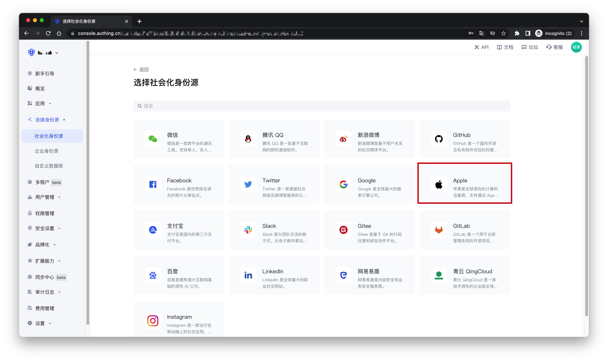
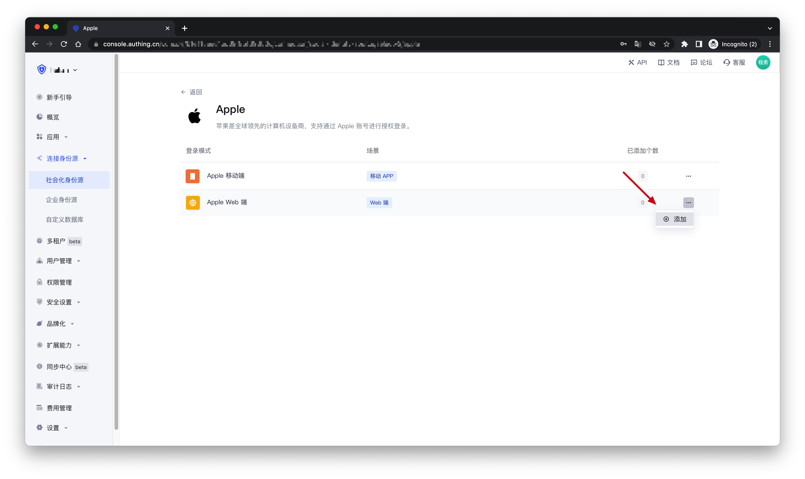
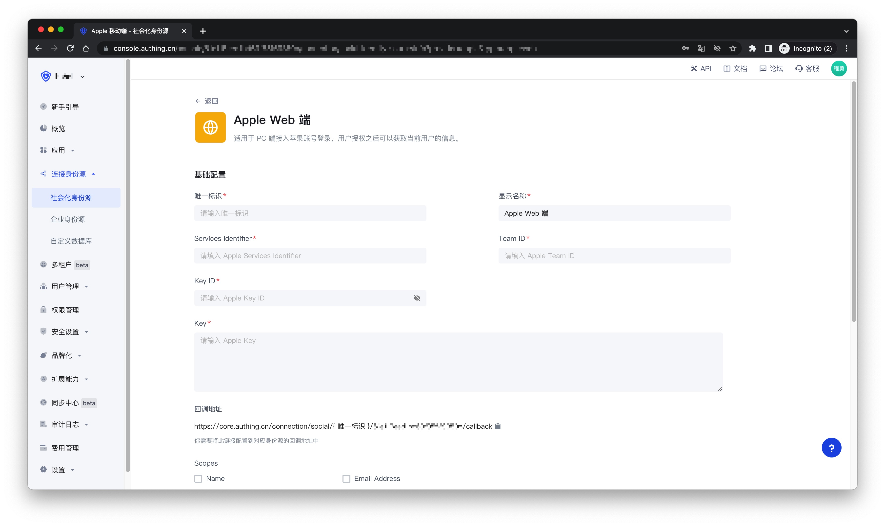
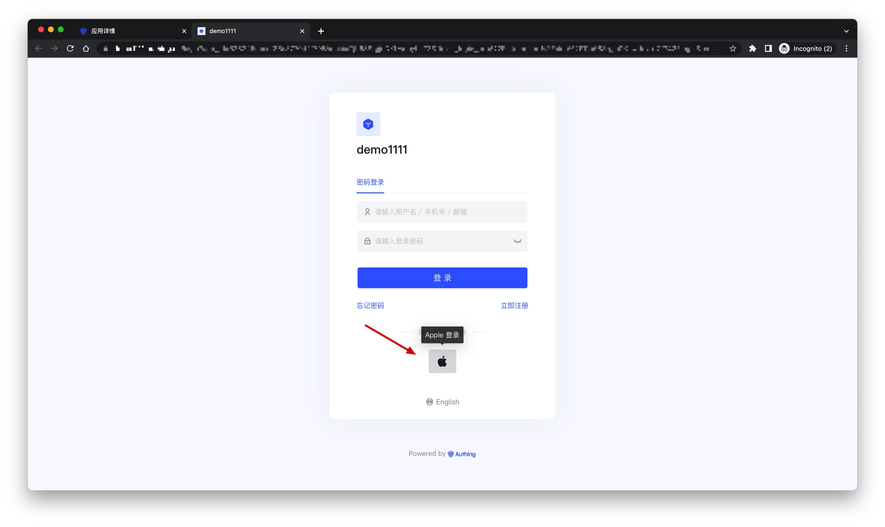

# Apple 社会化登录（Web 端）

<LastUpdated />

## 场景介绍

- **概述**：Apple 社会化登录是用户以 Apple 为身份源安全登录第三方应用或者网站。在 {{$localeConfig.brandName}} 中配置并开启 Apple 的社会化登录，即可实现通过 {{$localeConfig.brandName}} 快速获取 Apple 基本开放的信息和帮助用户实现免密登录功能。
- **应用场景**：PC 网站
- **终端用户预览图**：

## 注意事项

- 请确保您已经申请了苹果开发者账号，否则无法进行以下操作。申请个人、公司账号地址：[https://developer.apple.com/programs/](https://developer.apple.com/programs/) ， 申请企业账号地址：[https://developer.apple.com/programs/enterprise/](https://developer.apple.com/programs/enterprise/)
- 如果您未开通 {{$localeConfig.brandName}} 控制台账号，请先前往 [{{$localeConfig.brandName}} 控制台](https://authing.cn/) 注册开发者账号

## 步骤 1：在 Apple 开发者中心进行配置

### 获取 Team ID

前往 [Apple Developer Portal](https://developer.apple.com/account/#) 的 [Membership 页面](https://developer.apple.com/account/#/membership)，记录下`Team ID`：

### 创建一个 App ID

1. 在 Apple Developer Portal, **Certificates, Identifiers & Profiles** > **Identifiers** 页面，点击 ➕ 图标创建应用：

2. 选择 **App IDs** 然后点击 **Continue** 按钮继续：

3. 选择应用类型，然后点击 **Continue** 按钮继续：

4. 填写 **Description** 和 **Bundle ID**，并且在下面找到 **Sign in with Apple** 并勾选，请记录下此 **Bundle ID**：

5. 最后点击 **Continue** 按钮，在打开的页面中确认信息，点击 **Register** 按钮创建应用。

### 创建一个 Service ID

1. 回到 **Certificates, Identifiers & Profiles** > **Identifiers** 页面，点击 ➕ 图标，选择 **Services IDs** 然后点击 **Continue** 按钮继续：

2. 填写 **Description** 和 **Identifier**，然后点击 **Continue** 按钮，在打开的确认页面点击 **Register** 按钮创建 Service：

3. 找到刚刚创建的 Service，选中 **Sign In with Apple**，点击 **Configure**：

4. 填写 **Domains and Subdomains** 和 **Return URLs**:

- **Domains and Subdomains**：请填入`core.authing.cn`
- **Return URLs**：请填入`https://core.authing.cn/connection/social/{Unique Identifier}/{YOUR_USER_POOL_ID}/callback`，并将 `{Unique Identifier}` 替换成你正在 Authing 创建的身份源所填写的`唯一标识`，`{YOUR_USER_POOL_ID}` 替换成你的[用户池 ID](/guides/faqs/get-userpool-id-and-secret.md)

5. 点击 **Save**，**Continue**，最后点击 **Register**，并记录下该 **Service ID**。

### 配置 Signing Key

1. 回到 **Certificates, Identifiers & Profiles** 页面，切换到 **Keys** Tab，点击 ➕ 图标：

2. 输入名称并勾选上 **Sign in with Apple**, 点击 **Configure**，确保选中的 **Primary App ID** 是你刚刚创建的那一个：

3. 点击 **Save**, **Continue**, 最后点击 **Register**.

4. 创建之后，记录下 **Key ID**，然后点击 **Download** 下载该密钥：

## 步骤 2：在 {{$localeConfig.brandName}} 控制台配置 Apple 应用

2.1 请在 {{$localeConfig.brandName}} 控制台的「社会化身份源」页面，点击「创建社会化身份源」按钮，进入「选择社会化身份源」页面。

2.2 在「选择社会化身份源」页面，点击「Apple」卡片。

2.3 继续点击「Apple Web 端」登录模式，或者点击「**… 添加**」打开「Apple Web 端」配置页面。

2.4 在「Apple Web 端」配置页面，填写相关的字段信息。

| 字段                | 描述                                                                                                                                                         |
| ------------------- | ------------------------------------------------------------------------------------------------------------------------------------------------------------ |
| 唯一标识            | a. 唯一标识由小写字母、数字、- 组成，且长度小于 32 位。 b. 这是此连接的唯一标识，设置之后不能修改。                                                     |
| 显示名称            | 这个名称会显示在终端用户的登录界面的按钮上。                                                                                                                 |
| Services Identifier | Apple Service 的 ID。                                                                                                                                          |
| Team ID             | Apple 开发者团队 ID。                                                                                                                                          |
| Key ID              | Apple Signing Key 的 ID。                                                                                                                                      |
| Key                 | Apple Signing Key 的内容。                                                                                                                                     |
| Scopes              | 可以勾选 `Name` 和 `Email Address`。                                                                                                                               |
| 登录模式            | 开启「仅登录模式」后，只能登录既有账号，不能创建新账号，请谨慎选择。                                                                                         |
| 账号身份关联        | 不开启「账号身份关联」时，用户通过身份源登录时默认创建新用户。开启「账号身份关联」后，可以允许用户通过「字段匹配」或「询问绑定」的方式直接登录到已有的账号。 |

2.5 配置完成后，点击「创建」或者「保存」按钮完成创建。

## 步骤 3：开发接入

- **推荐开发接入方式**：使用托管登录页
- **优劣势描述**：运维简单，由 {{$localeConfig.brandName}} 负责运维。每个用户池有一个独立的二级域名；如果需要嵌入到你的应用，需要使用弹窗模式登录，即：点击登录按钮后，会弹出一个窗口，内容是 {{$localeConfig.brandName}} 托管的登录页面，或者将浏览器重定向到 {{$localeConfig.brandName}} 托管的登录页。
- **详细接入方法**：

  3.1 在 {{$localeConfig.brandName}} 控制台创建一个应用，详情查看：[如何在 {{$localeConfig.brandName}} 创建一个应用](/guides/app/create-app.md)

  3.2 在已创建好的「Apple」身份源连接详情页面，开启并关联一个在 {{$localeConfig.brandName}} 控制台创建的应用
  

  3.3 点击 {{$localeConfig.brandName}} 控制台的应用「体验登录」按钮，在弹出的登录窗口体验「Apple」登录
  

