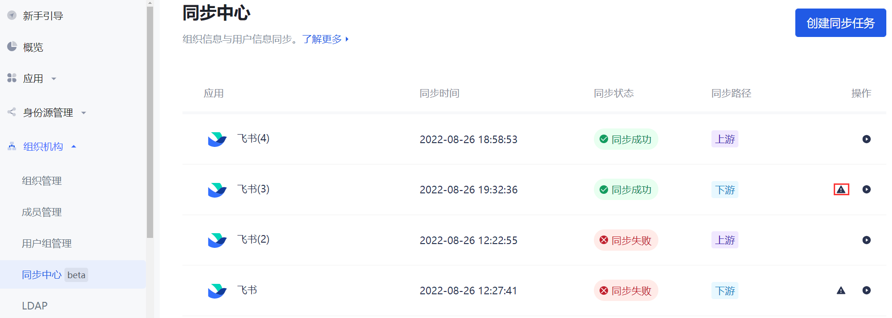
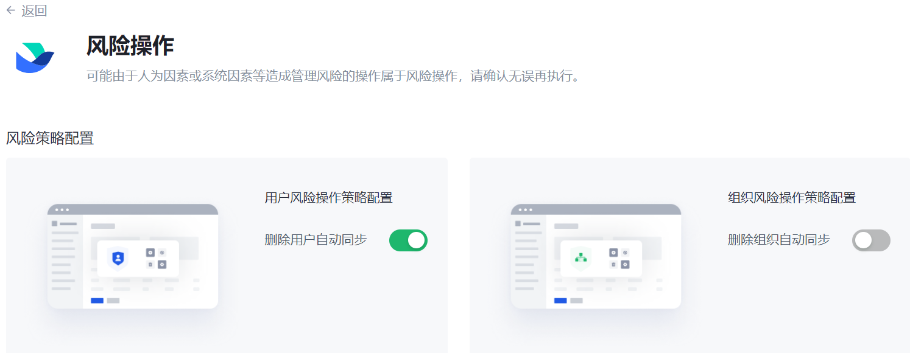
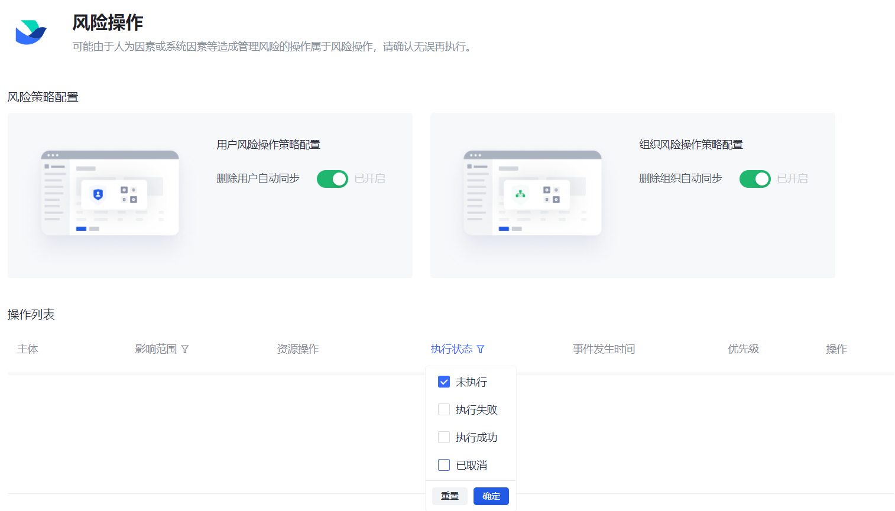

# 风险操作提示

<LastUpdated/>

{{$localeConfig.brandName}} 认为，删除操作可能由于人为因素或系统因素等造成管理风险，因此将删除操作视为风险操作。
在进行下游同步过程中，在 {{$localeConfig.brandName}} 控制台 **用户管理** 页面删除一个 **用户** 或 **部门** 时，需要在同步中心的 **风险操作** 页面进行二次确认。**手动同步**、**定时同步**、**实时同步** 都必须执行风险操作。

## 删除用户风险操作

### 第一步：配置风险策略

路径：**同步中心->应用同步任务配置详情页**

1. 在同步任务列表点击该应用所在行 **操作** 列 **处理风险操作** 按钮（或在应用同步任务配置详情页点击右上角 **风险操作** 按钮）。 打开 **风险操作** 页面。

2. 配置 **风险策略**。

### 第二步：删除用户

路径：**用户管理->用户列表**

1. 在 **用户列表** 页面选中一个用户，点击 **删除** 按钮。 打开确认删除提示框。

2. 点击 **删除**。

返回 **同步中心** 应用 **风险操作** 页，在 **操作列表** 点击表头 **执行状态**，勾选所有状态后，可查看到风险操作执行记录。

::: hint-info
默认是 **未执行** 状态，显示的是未执行列表。
:::

## 删除部门风险操作

删除部门操作同上。

::: hint-info
如果部门中存在用户，可能导致下游删除部门失败。
:::