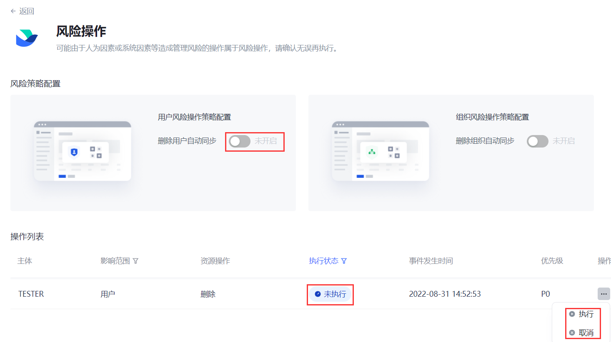

# 处理删除保护

<LastUpdated/>

{{$localeConfig.brandName}} 认为，删除操作可能由于人为因素或系统因素等造成管理风险，因此将删除操作视为风险操作。
在进行下游同步过程中，在 {{$localeConfig.brandName}} 控制台 **用户管理** 页面删除一个 **用户** 或 **部门** 时，需要在同步中心的 **风险操作** 页面进行二次确认。**手动同步**、**定时同步**、**实时同步** 都必须执行风险操作。

## 删除用户风险操作

### 自动同步

#### 步骤一：配置风险策略

路径：**同步中心->应用同步任务配置详情页**

1. 在同步任务列表点击该应用所在行 **操作** 列 **处理风险操作** 按钮（或在应用同步任务配置详情页点击右上角 **风险操作** 按钮）。 打开 **风险操作** 页面。

2. 配置 **风险策略**，打开 **删除用户自动同步** 开关。

#### 步骤二：删除用户

::: hint-info
* 待删除用户必须属于所建下游同步任务中 **同步范围** 指定的组织树和部门。
* 必须为待删除用户配置正确的手机号，否则同步失败。
:::

路径：**组织管理**

1. 在右侧用户列表页面选中一个用户，点击 **操作** 列 **更多** 按钮，选择 **办理离职**。 打开 **办理离职** 确认弹框。

2. 点击 **离职并删除**。

或者，

路径：**组织管理->成员管理**

在 **成员管理** 列表点击 **操作** 列 **删除** 按钮，删除一个成员。

#### 步骤三：查看风险操作列表

1. 返回 **同步中心**，点击同步任务列表相应同步任务 **操作** 列 **执行同步** 按钮。
2. 同步成功后，点击进入该同步任务详情页，点击页面右上角 **风险操作** 按钮（如有风险操作，该按钮会呈橙色）。 进入 **风险操作** 页。
3. 可以在页面下方 **操作列表** 点击表头 **执行状态**，查看不同状态的风险操作。

::: hint-info
* 取消勾选默认的 **未执行** 状态后，可查看到所有风险操作执行记录。
* 对于 **执行失败** 的风险操作，管理员可以选择 **重新执行** 或者 **取消** 风险操作。点击 **取消**，则当前风险操作状态变为 **已取消**。
:::

### 手动同步

::: hint-info
关闭 **风险策略配置** 开关，表示需要手动执行风险操作。
:::

在 **风险操作** 页关闭 **删除用户自动同步** 开关，删除组织树相应部门下的用户后，在相应同步任务 **风险操作** 页 **操作列表** 默认显示的是 **未执行** 的风险操作。

* 点击 **操作** 列 **执行** 按钮可执行风险操作，即在下游同步删除该用户。
* 点击 **操作** 列 **取消** 按钮不执行风险操作，即下游不会删除该用户。

::: hint-info
**取消** 执行后，不可再重新执行同步任务，会导致上下游数据不一致，请谨慎操作！
:::

## 删除部门风险操作

删除部门操作同上（通过开启 / 关闭 **删除组织自动同步** 按钮自动 / 手动同步组织相关风险操作）。

::: hint-info
如果部门中存在用户，可能导致下游删除部门失败。
:::