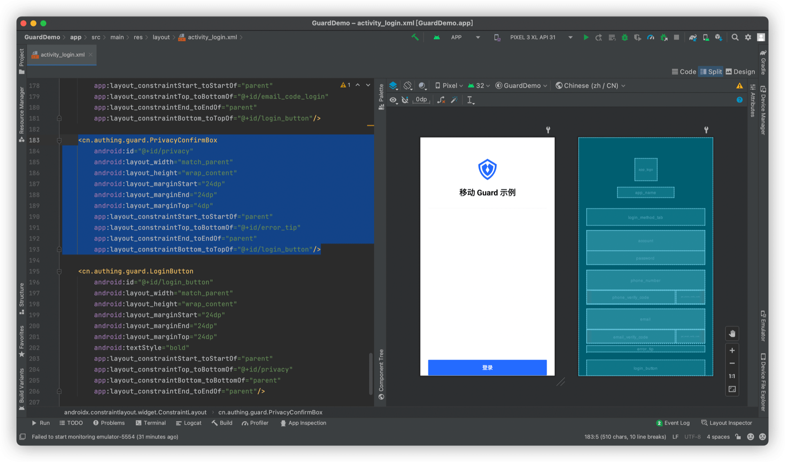
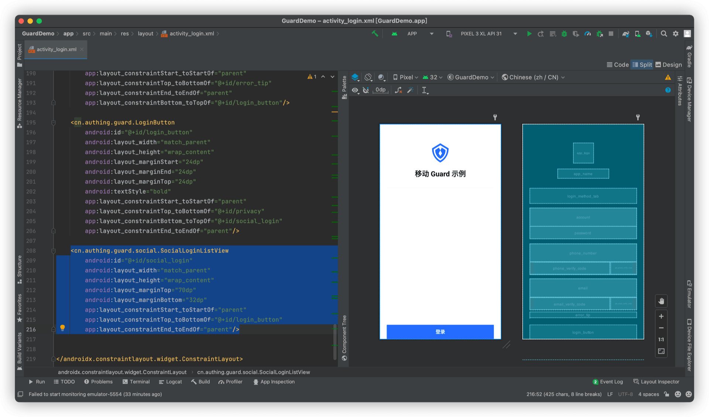

# 完善登录界面

<LastUpdated/>

阅读此教程之前，确保已经完成了 [开发准备](/reference-new/mobile/sdk-for-android/develop.md)

在上一个 [复杂登录教程](./advanced-login.md) 里面，我们构建了一个功能相对完善登录界面，接下来我们再补充两个常见功能：隐私协议和社会化登录入口。

## 隐私协议

放置一个 PrivacyConfirmBox



PrivacyConfirmBox 可以根据控制台设置动态调整显示类容，更多信息请参考 [详细说明](./../basic/privacy-confirm-box.md)

## 社会化登录入口

放置一个 SocialLoginListView



SocialLoginListView 可以根据控制台设置动态调整显示类容，也可以手动设置社会化登录源。更多信息请参考 [详细说明](./../social/social-login-listview.md)

## 完成


此教程再次展示了 Guard 超组件的强大之处。我们仅仅 “放置” 了两个超组件即实现了隐私协议和社会化登录源。

## 完整示例代码

```xml
<?xml version="1.0" encoding="utf-8"?>
<androidx.constraintlayout.widget.ConstraintLayout
    xmlns:android="http://schemas.android.com/apk/res/android"
    xmlns:app="http://schemas.android.com/apk/res-auto"
    android:layout_width="match_parent"
    android:layout_height="wrap_content">

    <cn.authing.guard.AppLogo
        android:id="@+id/app_logo"
        android:layout_width="68dp"
        android:layout_height="68dp"
        android:layout_marginTop="40dp"
        app:layout_constraintStart_toStartOf="parent"
        app:layout_constraintEnd_toEndOf="parent"
        app:layout_constraintTop_toTopOf="parent"
        app:layout_constraintBottom_toTopOf="@+id/app_name"
        app:layout_constraintVertical_chainStyle="packed"
        android:src="@drawable/ic_authing_default_logo"/>

    <cn.authing.guard.AppName
        android:id="@+id/app_name"
        android:layout_width="wrap_content"
        android:layout_height="wrap_content"
        android:text="移动 Guard 示例"
        android:layout_marginTop="20dp"
        app:layout_constraintStart_toStartOf="parent"
        app:layout_constraintTop_toBottomOf="@+id/app_logo"
        app:layout_constraintBottom_toTopOf="@+id/login_method_tab"
        app:layout_constraintEnd_toEndOf="parent"/>

    <cn.authing.guard.LoginMethodTab
        android:id="@+id/login_method_tab"
        android:layout_width="match_parent"
        android:layout_height="52dp"
        android:layout_marginTop="32dp"
        android:layout_marginStart="24dp"
        android:layout_marginEnd="24dp"
        app:layout_constraintStart_toStartOf="parent"
        app:layout_constraintTop_toBottomOf="@+id/app_name"
        app:layout_constraintEnd_toEndOf="parent"
        app:layout_constraintBottom_toTopOf="@+id/account_login"/>

    <cn.authing.guard.LoginContainer
        android:id="@+id/account_login"
        app:type="accountPassword"
        android:clipChildren="false"
        android:visibility="invisible"
        android:layout_width="match_parent"
        android:layout_height="wrap_content"
        android:layout_marginStart="24dp"
        android:layout_marginEnd="24dp"
        android:layout_marginTop="16dp"
        android:orientation="vertical"
        app:layout_constraintStart_toStartOf="parent"
        app:layout_constraintTop_toBottomOf="@+id/login_method_tab"
        app:layout_constraintEnd_toEndOf="parent"
        app:layout_constraintBottom_toTopOf="@+id/phone_code_login">
        <cn.authing.guard.AccountEditText
            android:id="@+id/account"
            android:layout_width="match_parent"
            android:layout_height="wrap_content"
            android:background="@null"
            app:leftIconDrawable="@drawable/ic_authing_user"
            app:errorEnabled="true" />
        <cn.authing.guard.PasswordEditText
            android:id="@+id/password"
            android:layout_width="match_parent"
            android:layout_height="wrap_content"
            android:background="@null"
            android:layout_marginTop="0dp"
            app:leftIconDrawable="@drawable/ic_authing_password"
            app:clearAllEnabled="false"
            app:errorEnabled="false" />
    </cn.authing.guard.LoginContainer>

    <cn.authing.guard.LoginContainer
        android:id="@+id/phone_code_login"
        app:type="phoneCode"
        android:clipChildren="false"
        android:visibility="invisible"
        android:layout_width="match_parent"
        android:layout_height="wrap_content"
        android:layout_marginStart="24dp"
        android:layout_marginEnd="24dp"
        android:layout_marginTop="16dp"
        android:orientation="vertical"
        app:layout_constraintStart_toStartOf="parent"
        app:layout_constraintTop_toBottomOf="@+id/account_login"
        app:layout_constraintEnd_toEndOf="parent"
        app:layout_constraintBottom_toTopOf="@+id/email_code_login">
        <cn.authing.guard.PhoneNumberEditText
            android:id="@+id/phone_number"
            android:background="@null"
            android:layout_width="match_parent"
            android:layout_height="wrap_content"
            app:errorEnabled="true"
            app:leftIconDrawable="@drawable/ic_authing_cellphone">
        </cn.authing.guard.PhoneNumberEditText>
        <LinearLayout
            android:layout_width="match_parent"
            android:layout_height="wrap_content"
            android:orientation="horizontal">
            <cn.authing.guard.VerifyCodeEditText
                android:id="@+id/phone_verify_code"
                android:layout_width="0dp"
                android:layout_height="wrap_content"
                android:layout_weight="1"
                android:background="@null"
                app:errorEnabled="false"
                app:leftIconDrawable="@drawable/ic_authing_shield_check" />
            <cn.authing.guard.GetVerifyCodeButton
                android:id="@+id/get_phone_verify_code"
                android:stateListAnimator="@null"
                android:background="@drawable/authing_get_code_button_background"
                android:layout_width="wrap_content"
                android:layout_height="42dp"
                android:layout_marginStart="4dp"
                android:paddingStart="4dp"
                android:paddingEnd="4dp"
                android:textColor="@color/button_text" />
        </LinearLayout>
    </cn.authing.guard.LoginContainer>

    <cn.authing.guard.LoginContainer
        android:id="@+id/email_code_login"
        app:type="emailCode"
        android:clipChildren="false"
        android:visibility="invisible"
        android:layout_width="match_parent"
        android:layout_height="wrap_content"
        android:layout_marginStart="24dp"
        android:layout_marginEnd="24dp"
        android:layout_marginTop="16dp"
        android:orientation="vertical"
        app:layout_constraintStart_toStartOf="parent"
        app:layout_constraintTop_toBottomOf="@+id/phone_code_login"
        app:layout_constraintEnd_toEndOf="parent"
        app:layout_constraintBottom_toTopOf="@+id/error_tip">
        <cn.authing.guard.EmailEditText
            android:id="@+id/email"
            android:background="@null"
            android:layout_width="match_parent"
            android:layout_height="wrap_content"
            app:errorEnabled="true"
            app:leftIconDrawable="@drawable/ic_authing_email"/>
        <LinearLayout
            android:layout_width="match_parent"
            android:layout_height="wrap_content"
            android:orientation="horizontal">
            <cn.authing.guard.VerifyCodeEditText
                android:id="@+id/email_verify_code"
                android:layout_width="0dp"
                android:layout_height="wrap_content"
                android:layout_weight="1"
                android:background="@null"
                app:errorEnabled="false"
                app:leftIconDrawable="@drawable/ic_authing_shield_check"/>
            <cn.authing.guard.GetEmailCodeButton
                android:id="@+id/get_email_verify_code"
                android:stateListAnimator="@null"
                android:background="@drawable/authing_get_code_button_background"
                android:layout_width="wrap_content"
                android:layout_height="42dp"
                android:layout_marginStart="4dp"
                android:paddingStart="4dp"
                android:paddingEnd="4dp"
                android:textColor="@color/button_text"/>
        </LinearLayout>
    </cn.authing.guard.LoginContainer>

    <cn.authing.guard.ErrorTextView
        android:id="@+id/error_tip"
        android:layout_width="match_parent"
        android:layout_height="wrap_content"
        android:layout_marginStart="24dp"
        android:layout_marginEnd="24dp"
        android:layout_marginTop="8dp"
        app:layout_constraintStart_toStartOf="parent"
        app:layout_constraintTop_toBottomOf="@+id/email_code_login"
        app:layout_constraintEnd_toEndOf="parent"
        app:layout_constraintBottom_toTopOf="@+id/privacy"/>

    <cn.authing.guard.PrivacyConfirmBox
        android:id="@+id/privacy"
        android:layout_width="match_parent"
        android:layout_height="wrap_content"
        android:layout_marginStart="24dp"
        android:layout_marginEnd="24dp"
        android:layout_marginTop="4dp"
        app:layout_constraintStart_toStartOf="parent"
        app:layout_constraintTop_toBottomOf="@+id/error_tip"
        app:layout_constraintEnd_toEndOf="parent"
        app:layout_constraintBottom_toTopOf="@+id/login_button"/>

    <cn.authing.guard.LoginButton
        android:id="@+id/login_button"
        android:layout_width="match_parent"
        android:layout_height="wrap_content"
        android:layout_marginStart="24dp"
        android:layout_marginEnd="24dp"
        android:layout_marginTop="24dp"
        android:textStyle="bold"
        app:layout_constraintStart_toStartOf="parent"
        app:layout_constraintTop_toBottomOf="@+id/privacy"
        app:layout_constraintBottom_toTopOf="@+id/social_login"
        app:layout_constraintEnd_toEndOf="parent"/>

    <cn.authing.guard.social.SocialLoginListView
        android:id="@+id/social_login"
        android:layout_width="match_parent"
        android:layout_height="wrap_content"
        android:layout_marginTop="70dp"
        android:layout_marginBottom="32dp"
        app:layout_constraintStart_toStartOf="parent"
        app:layout_constraintTop_toBottomOf="@+id/login_button"
        app:layout_constraintEnd_toEndOf="parent"/>

</androidx.constraintlayout.widget.ConstraintLayout>
```