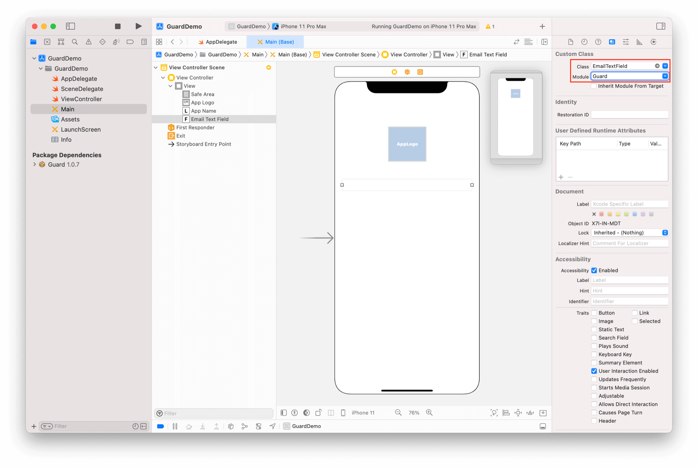

# 基础注册示例

<LastUpdated/>

阅读此教程之前，确保已经完成了 [开发准备](/reference-new/mobile/sdk-for-ios/develop)

## 在 xib 上放置超组件

放置一个 TextField，将其类型改为 EmailTextField



再放置一个 TextField，将其类型改为 PasswordTextField


再放置一个 TextField，将其类型改为 PasswordConfirmTextField


再放置一个 Label 将其类型改为 ErrorLabel


再放置一个 Button，将其类型改为 RegisterButton


## 运行


一个具有注册业务能力的界面就开发完了，输入有效的邮箱和密码，点击注册按钮就可以完成注册。如果注册出现错误，服务器返回的错误信息也能直接显示在 ErrorLabel 上。

>Guard 超组件提供了一些默认的视觉效果，如输入框获取焦点时，会播放一个高亮边框的动画；输入框提示语跟随 Authing 控制台配置；密码输入框默认提供 “显示明文”按钮；点击注册按钮时，会播放加载动画等等。如果需要自定这些视觉效果，请参考每个组件的详细说明。

接下来，我们需要设置回调以获取用户信息：

```swift
import Guard
if let registerButton: RegisterButton = Util.findView(view, viewClass: RegisterButton.self) {
    registerButton.setAuthCompletion { code, message, userInfo in
        if (code == 200) {
            if let email = userInfo?.getEmail() {
                print("\(email) registered")
            }
        }
    }
}
```

此教程展示了如何在 5 分钟左右的时间构建一个简单的注册界面。接下来，我们再构建一个更为复杂的注册界面。

<br>
<span style="background-color: #396aff;a:link:color:#FFF;padding:8px;border-radius: 4px;"><a href="./advanced-register.html" style="color:#FFF;">复杂注册示例 →</a>
</span>