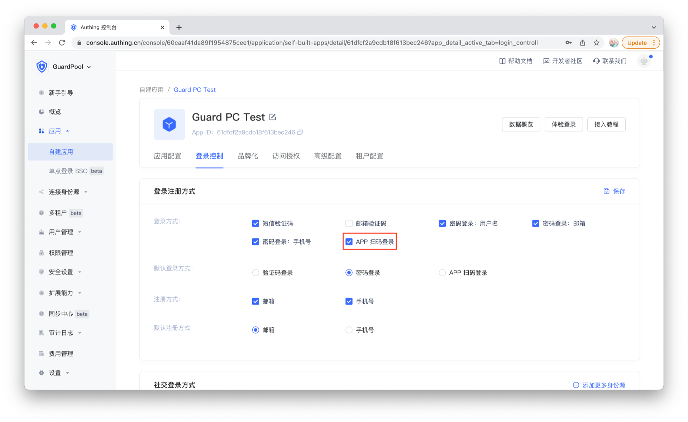
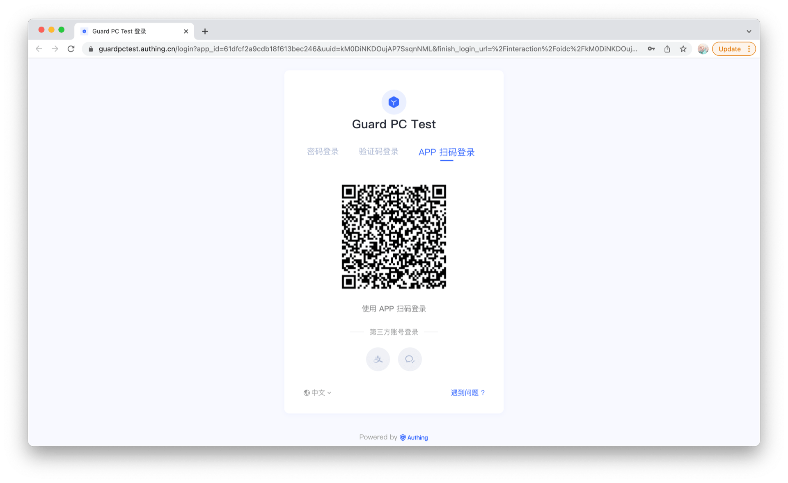

# 扫码认证 API

<LastUpdated/>

要使用自建 App 扫码登录能力，请在 Authing 控制台勾选 "App 扫码登录" 选项。



当 Web 应用需要登录时，登录界面会显示一个可供 App 扫码的二维码，如下图：



二维码数据结构如下：

```json
{
    "scene": "APP_AUTH",
    "random": "5e05f0c57fde537d950f7da5",
    "userPoolId": "5e04ae0d5f3cee22fb37612b",
    "createdAt": "2019-12-27T11:53:41.260Z",
    "expireAt": "2019-12-27T11:55:41.260Z"
}
```

在 App 侧，确保 App 处于登录状态，在需要授权登录时，依次调用下面 API

## 标记二维码

此接口调用成功后，网页的二维码上面会显示用户头像

>注意：调用此接口前，App 必须处于登录状态


```java
public static void markQRCodeScanned(String ticket, @NotNull AuthCallback<JSONObject> callback)
```

**参数**

* *`ticket`* 二维码数据里面的 random 字段

**示例**

```java
AuthClient.markQRCodeScanned(random, (code, message, data) -> {
    if (code == 200) {
        // notify user to authorize
    }
});
```

**错误码**

* `500` 无效二维码
* `2020` 未登录

<br>

## 确认二维码登录

使用二维码登录。分两步的好处是，App 可以在扫描之后给用户一个提示，待用户确认之后再登录。

>注意：调用此接口之前必须先调用 [标记二维码](#标记二维码)


```java
public static void loginByScannedTicket(String ticket, @NotNull AuthCallback<JSONObject> callback)
```

**参数**

* *`ticket`* 二维码数据里面的 random 字段

**示例**

```java
AuthClient.loginByScannedTicket(random, (code, message, data) -> {
    if (code == 200) {
        // logged in
    }
});
```

**错误码**

* `500` 无效二维码
* `2020` 未登录

<br>
