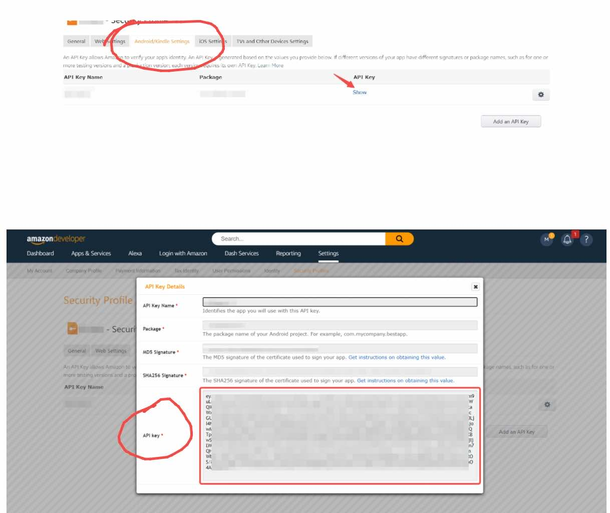

# 亚马逊登录

<LastUpdated/>

## 准备工作

**配置工作**：在 [亚马逊开发者平台](https://developer.amazon.com) 及 [Authing Console 控制台](https://authing.cn/)进行应用配置，请参阅 [亚马逊接入准备](../../../guides/connections/social/amazon-mobile/README.md)。

**开发参阅**：请参阅 [亚马逊官方文档](https://developer.amazon.com/zh/docs/login-with-amazon/android-docs.html)。

:::hint-info
此功能在 android guard sdk 1.5.6 版本新增。
:::

<br>

## 集成步骤

### 第一步：下载 Login with Amazon SDK

在这个页面下载 [Login with Amazon SDK](https://amzndevresources.com/login-with-amazon/sdk/LoginWithAmazon_Android.zip)

:::hint-info
解压文件，找到 `login-with-amazon-sdk.jar`文件拷贝到 app 的 libs 目录。
:::

### 第二步：添加依赖

```groovy
dependencies {
    implementation 'cn.authing:guard:+'
    implementation files('libs/login-with-amazon-sdk.jar')
}
```

:::hint-info
Guard 只是 compileOnly 依赖 Login with Amazon SDK，这样可以让 App 按需引入，防止 Guard aar 包随着支持的第三方登录增加而越来越大。所以每增加一个第三方身份源，都需要 App 手动加上该身份源的依赖。
:::

### 第三步：添加API密钥

您的Android应用注册Login with Amazon时，会分配到一个。API密钥。亚马逊授权管理器将使用该标识符，向Login with Amazon标识您的应用。授权服务。

如果您使用亚马逊应用商店为应用签名，亚马逊应用商店会自动提供API密钥。如果您没有使用亚马逊应用商店，亚马逊授权管理器在运行时将从`assets`目录中的`api_key.txt`文件中加载此值。

可以在如下位置获取到 API key：



1. 在 app 项目 main 目录下新建 assets 文件夹。
2. 在 assets 文件夹中新建文件命名为 **api_key.txt**。
3. 将您的 API key 添加到文本文件保存。

### 第四步：配置 AndroidManifest

在 AndroidManifest.xml 文件的 application 中加入：

```xml
<activity android:name="com.amazon.identity.auth.device.workflow.WorkflowActivity"
        android:theme="@android:style/Theme.NoDisplay"
        android:allowTaskReparenting="true"
        android:launchMode="singleTask">
        <intent-filter>
            <action android:name="android.intent.action.VIEW"/>
            <category android:name="android.intent.category.DEFAULT"/>
            <category android:name="android.intent.category.BROWSABLE"/>
            <!-- android:host must use the full package name found in Manifest General Attributes -->
            <data android:host="${applicationId}" android:scheme="amzn"/>
        </intent-filter>
</activity>
```

:::hint-info
如果您没有使用Gradle构建系统，请将` ${applicationId}`替换为此应用的程序包名称。
:::

### 第五步：初始化

在应用启动的时候初始化 Guard Android SDK：

```java
// context is application or initial activity
// ”AUTHING_APP_ID“ is obtained from the Authing console
Authing.init(context, "AUTHING_APP_ID");
Authing.setAuthProtocol(Authing.AuthProtocol.EOIDC)
```


### 第六步：分场景使用

#### 使用托管页
在需要登录认证的地方启动托管页：

```java
// this is the activity context
AuthFlow.start(this);
```

通过以上步骤即可简单快速地通过配置 Authing 管理控制台后自动拥有亚马逊登录功能，登录入口会在 Guard 内置登录界面的社会化登录按钮列表中体现。

#### 使用登录按钮

如果使用我们提供的小米登录按钮。

1. 布局文件里面加上如下代码：

```xml
 <cn.authing.guard.social.view.AmazonLoginButton
    android:id="@+id/btn_login"
    android:background="@drawable/authing_button_background"
    android:textColor="@color/white"
    android:layout_width="match_parent"
    android:layout_height="wrap_content" />
```

2. 然后在代码里面处理事件：

```java
AmazonLoginButton button = findViewById(R.id.btn_login);
button.setOnLoginListener(new AuthCallback<UserInfo>() {
    @Override
    public void call(int code, String message, UserInfo data) {
      	if (code == 200) {
        	// 登录成功，data 是用户信息
       	} else {
        	// 登录失败
      	}
    }
});
```

#### 使用登录授权类
如果不想使用我们内置的按钮，想完全自己实现 UI，则可以在按钮的点击事件里面调用 `Amazon` 类的授权函数，此类集成了拉起亚马逊授权登录的业务逻辑：

```java
Amazon.getInstance().login(appContext, new AuthCallback<UserInfo>() {
    @Override
    public void call(int code, String message, UserInfo data) {
        if (code == 200) {
          // 登录成功，data 是用户信息
        } else {
          // 登录失败
        }
    }
});
```

​	`data` 包含 `idToken` 以及用户信息（`用户名`、`昵称`、`姓名`等）。

**注意：使用登录按钮或者登录授权类时，需要在 Activity 的 onCreate、onResume 函数中加入如下代码：**

```java
@Override
protected void onCreate(Bundle savedInstanceState) {
    super.onCreate(savedInstanceState);
    Amazon.getInstance().onCreate(this);
}

@Override
protected void onResume() {
    super.onResume();
    Lark.getInstance().onResume(this);
    Amazon.getInstance().onResume();
}
```

#### 使用登录 API 

如果想完全自己实现亚马逊登录 UI 以及获取授权码逻辑，拿到授权码后，可以调用下面 API 换取用户信息：

```java
public static void loginByAmazon(String accessToken, @NotNull AuthCallback<UserInfo> callback)
```

**参数**

*`accessToken`* 亚马逊 accessToken

**示例**

如果你只需要获取到用户信息（`用户名`、`昵称`、`姓名`等）和 `idToken`，调用：

```java
AuthClient.loginByAmazon(accessToken, new AuthCallback<UserInfo>() {
    @Override
    public void call(int code, String message, UserInfo data) {
        if (code == 200) {
          // 登录成功，data 是用户信息, 包含 idToken。
        } else {
          // 登录失败
        }
    }
});
```

如果你需要获取到用户信息（`用户名`、`昵称`、`姓名`等）、`idToken`、`accessToken` 和 `refreshToken`，调用：

```java
OIDCClient oidcClient = new OIDCClient();
oidcClient.loginByAmazon(accessToken, new AuthCallback<UserInfo>() {
    @Override
    public void call(int code, String message, UserInfo data) {
        if (code == 200) {
          // 登录成功，data 是用户信息, 包含 idToken、accessToke and refreshToken。
        } else {
          // 登录失败
        }
    }
});
```

