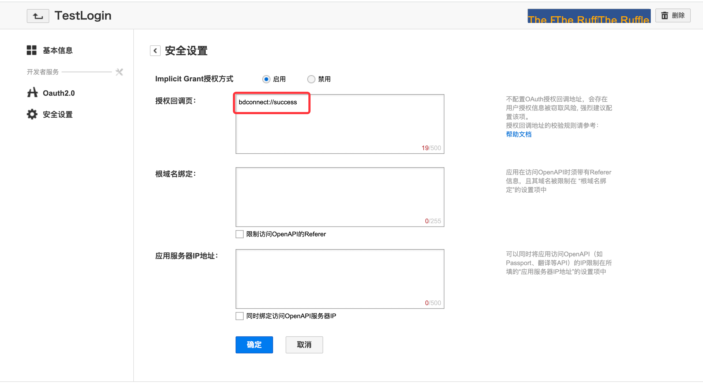

# 百度登录

<LastUpdated/>

## 准备工作

在 [百度开发者平台](https://developer.baidu.com/) 及 [Authing Console 控制台](https://authing.cn/)进行配置，请参阅 [百度移动端接入准备](../../../guides/connections/social/baidu-mobile/README.md)。

:::hint-info
此功能在 android guard sdk 1.5.1 版本新增。
:::

<br>

## 集成步骤

### 第一步：添加依赖

1. 先下载[百度 SDK](http://developer.baidu.com/wiki/index.php?title=docs/oauth/showcase)，然后放在项目 libs 目录下。

2. 在项目的 build.gradle 的 dependencies 添加依赖：

```groovy
implementation 'cn.authing:guard:+'
implementation files('libs/baidu-android-openapi-sdk.jar')
```

:::hint-info
Guard 只是 compileOnly 依赖 baidu-android-openapi-sdk，这样可以让 App 按需引入，防止 Guard aar 包随着支持的第三方登录增加而越来越大。所以每增加一个第三方身份源，都需要 App 手动加上该身份源的依赖。
:::

### 第二步：增加授权回调页

在百度应用后台增加授权回调页 `bdconnect://success`，如：



### 第三步：初始化

在应用启动的时候初始化 Guard Android SDK：

```java
// context is application or initial activity
// ”AUTHING_APP_ID“ is obtained from the Authing console
Authing.init(context, "AUTHING_APP_ID");
Authing.setAuthProtocol(Authing.AuthProtocol.EOIDC)
```

### 第四步：分场景使用

- #### 使用托管页
  在需要登录认证的地方启动托管页：
```java
// this is the activity context
AuthFlow.start(this);
```

通过以上步骤即可简单快速地通过配置 Authing 管理控制台后自动拥有百度登录功能，登录入口会在 Guard 内置登录界面的社会化登录按钮列表中体现。

- #### 使用百度登录按钮
    如果使用我们提供的百度登录按钮。

​		1. 布局文件里面加上如下代码：

```xml
 <cn.authing.guard.social.view.BaiduLoginButton
    android:id="@+id/btn_login"
    android:background="@drawable/authing_button_background"
    android:textColor="@color/white"
    android:layout_width="match_parent"
    android:layout_height="wrap_content" />
```

​		2. 然后在代码里面处理事件：

```java
BaiduLoginButton button = findViewById(R.btn_login);
button.setOnLoginListener(new AuthCallback<UserInfo>() {
    @Override
    public void call(int code, String message, UserInfo data) {
      	if (code == 200) {
        	// 登录成功，data 是用户信息
       	} else {
        	// 登录失败
      	}
    }
});
```

- #### 使用百度登录授权类
  如果不想使用我们内置的按钮，想完全自己实现 UI，则可以在按钮的点击事件里面调用 `Baidu` 类的授权函数，此类集成了拉起百度授权登录的业务逻辑：

```java
Baidu.getInstance().login(appContext, new AuthCallback<UserInfo>() {
    @Override
    public void call(int code, String message, UserInfo data) {
        if (code == 200) {
          // 登录成功，data 是用户信息
        } else {
          // 登录失败
        }
    }
});
```

​	`data` 包含 `idToken` 以及用户信息（`用户名`、`昵称`、`姓名`等）。

- #### 使用百度登录 API 

  如果想完全自己实现百度登录 UI 以及获取授权码逻辑，拿到授权码后，可以调用下面 API 换取用户信息：

```java
public static void loginByBaidu(String accessToken, @NotNull AuthCallback<UserInfo> callback)
```

**参数**

*`accessToken`* 百度 token

**示例**

如果你只需要获取到用户信息（`用户名`、`昵称`、`姓名`等）和 `idToken`，调用：

```java
AuthClient.loginByBaidu(accessToken, new AuthCallback<UserInfo>() {
    @Override
    public void call(int code, String message, UserInfo data) {
        if (code == 200) {
          // 登录成功，data 是用户信息, 包含 idToken。
        } else {
          // 登录失败
        }
    }
});
```

如果你需要获取到用户信息（`用户名`、`昵称`、`姓名`等）、`idToken`、`accessToken` 和 `refreshToken`，调用：

```java
OIDCClient oidcClient = new OIDCClient();
oidcClient.loginByBaidu(accessToken, new AuthCallback<UserInfo>() {
    @Override
    public void call(int code, String message, UserInfo data) {
        if (code == 200) {
          // 登录成功，data 是用户信息, 包含 idToken、accessToke and refreshToken。
        } else {
          // 登录失败
        }
    }
});
```

