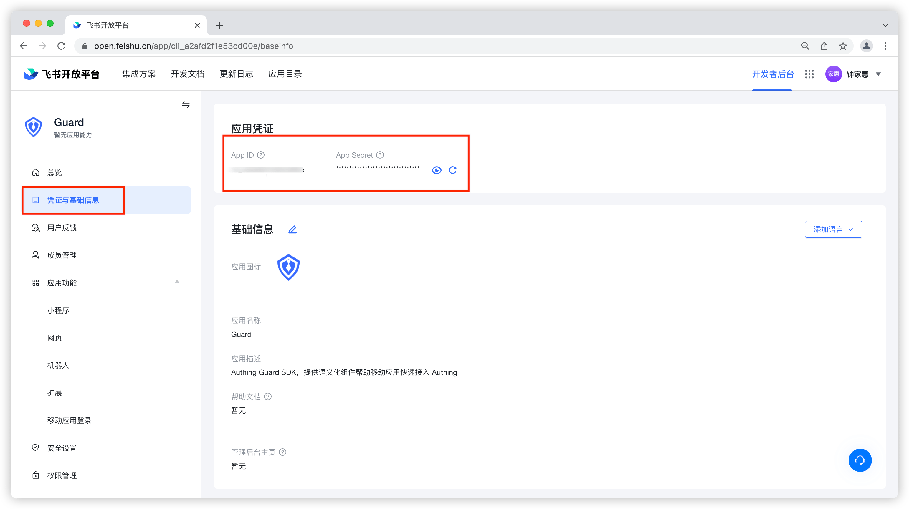
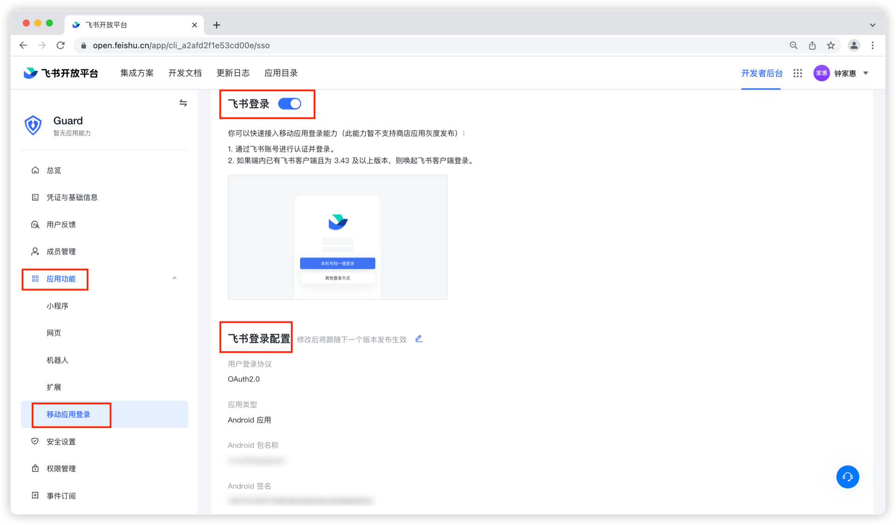
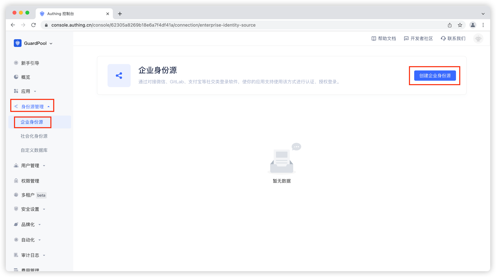
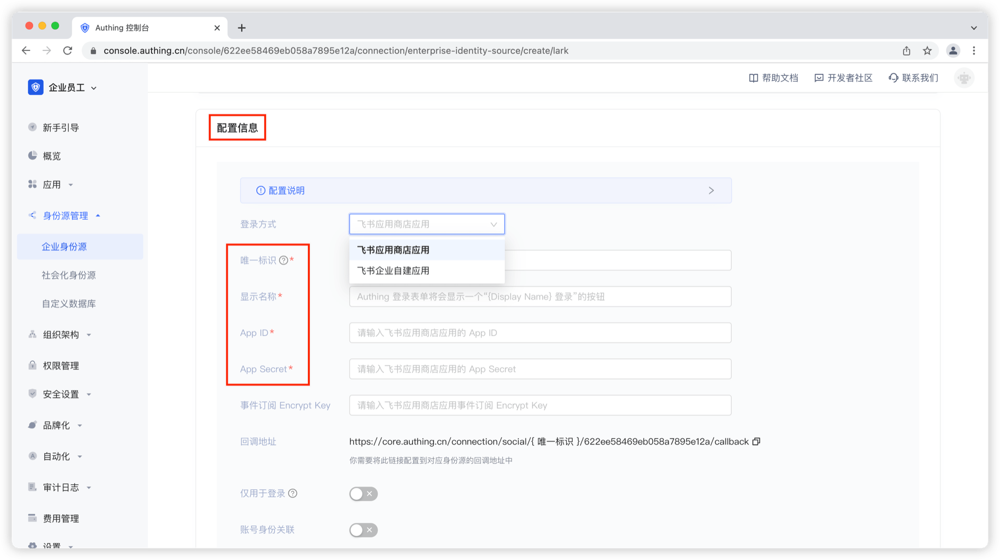

# 飞书登录

<LastUpdated/>

集成飞书登录的 3 个步骤

- 在飞书开放平台注册并且配置应用
- 在 Authing 管理控制台配置应用
- 集成 Android SDK

## STEP 1 ：在[飞书开放平台](https://open.feishu.cn/)注册并且配置应用

1. 获取 AppId 和 AppSecret

   

2. 设置 Android 应用信息（请务必打开飞书登录）

   


## STEP 2 ：在 [Authing 管理控制台](https://console.authing.cn/)配置应用

1. 选择或者创建一个用户池—>身份源管理—>企业身份源—>创建企业身份源

   

2. 填写配置信息

   登录方式：飞书开放平台注册的应用类型

   唯一标志性：自定义

   显示名称：自定义

   AppId：飞书开放平台注册的应用 AppId

   AppSecret：飞书开放平台注册的应用 AppSecret

   


## STEP 3 ：集成 Android SDK

1. 设置依赖

- 下载[飞书授权 sdk 库](https://sf3-cn.feishucdn.com/obj/lark-eco-passport/LarkSSOSDKAndroid-3.0.8.zip)；
- 将下载的 sdk aar 文件拷贝到 app/libs 目录下；
- 在 app 的 build.gradle 文件中引入该 aar，引入相关依赖项。

```groovy
implementation files ('libs/larksso-3.0.8.aar')
implementation 'com.alibaba:fastjson:1.1.58.android'
```

> Guard 只是 compileOnly 依赖飞书，这样可以让 App 按需引入，防止 Guard aar 包随着支持的第三方登录增加而越来越大。所以每增加一个第三方身份源，都需要 App 手动加上该身份源的依赖

2. 在应用启动时初始化 Authing

```java
// context is application or initial activity
// ”your_authing_app_id“ is obtained from the Authing console
Authing.init(context, "your_authing_app_id");
```


**通过以上 3 步即可简单快速的通过 Authing 管理控制台配置后自动获取飞书身份源，登录入口会在 Guard 内置登录界面的社会化登录按钮列表中体现**


- 接下来，如果使用我们提供的飞书登录按钮，则在布局文件里面加上（或者代码初始化添加）

```xml
<cn.authing.guard.social.LarkLoginButton
    android:id="@+id/btn_lark_login"
    android:layout_width="48dp"
    android:layout_height="48dp" />
```

然后在 java 代码里面处理事件

```java
LarkLoginButton button = findViewById(R.id.btn_lark_login);
button.setOnLoginListener((ok, data) -> {
    if (ok) {
        // 登录成功，data 是用户信息
    } else {
        // 登录失败
    }
});
```


- 如果不想使用我们内置的按钮，则可以在自己按钮的点击事件里面调用 Authing 飞书登录 API
```java
Lark.login(appContext, ((ok, data) -> {
    if (ok) {
        // 登录成功，data 是用户信息
    } else {
        // 登录失败
    }
}));
```


- 如果想完全自己实现飞书登录，拿到授权码后，可以调用下面 API 换取 Authing 用户信息

```java
public static void loginByLark(String authCode, @NotNull AuthCallback<UserInfo> callback)
```

**参数**

* *authCode* 飞书授权码

**示例**

```java
AuthClient.loginByLark(authCode, (code, message, userInfo)->{
    if (code == 200) {
        // userInfo：用户信息
    }
});
```