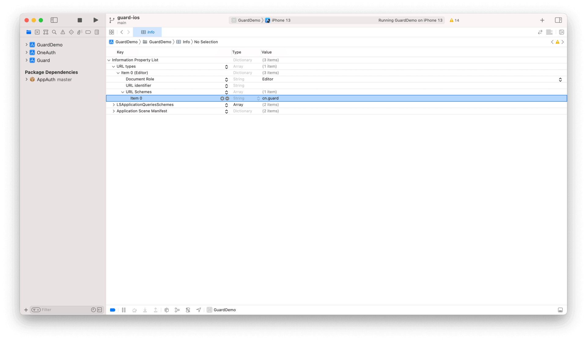

# 支付宝登录

<LastUpdated/>

## 初始化 Guard SDK

通过 Swift Package Manager 引入 Guard 依赖并调用初始化函数。[详细步骤](/reference/sdk-for-ios)

<br>

## 设置回调信息

在应用的 Info.plist 里面设置回调 URL Scheme



<br>

## 在应用启动的时候设置支付宝：

```swift
import Guard
Authing.setupAlipay("your_alipay_appid", customScheme: "cn.guard")
```

>第一个参数为支付宝应用 id；customScheme 和第 2 步填入 Info.plist 的值必须一致

<br>

## 处理支付宝回调

支付宝返回应用后，如果使用了 SceneDelegate，则需要在 SceneDelegate.swift 里面重载下面的函数：

```swift
func scene(_ scene: UIScene, openURLContexts URLContexts: Set<UIOpenURLContext>) {
    NotificationCenter.default.post(name: NSNotification.Name(rawValue: "alipayLoginOK"), object: URLContexts.first?.url)
}
```

如果未使用 SceneDelegate，则需要在 AppDelegate 里面重载

```swift
func application(_ app: UIApplication, open url: URL, options: [UIApplication.OpenURLOptionsKey : Any] = [:]) -> Bool {
    NotificationCenter.default.post(name: NSNotification.Name(rawValue: "alipayLoginOK"), object: URLContexts.first?.url)
    return true
}
```

<br>

## 发起支付宝认证

通过我们提供的语义化 Hyper Component，只需要在 xib 里面放置一个：

```swift
AlipayLoginButton
```

所有的逻辑由我们语义化引擎自动处理

如果不想使用我们内置的按钮，则可以在自己按钮的点击事件里面调用：

```swift
let alipay: Alipay = Alipay()
alipay.login { code, message, userInfo in
    if (code == 200) {
        // logged in
    } else {
        // handle error
    }
}
```

>注意：alipay 对象不能是局部变量，需要保存为控件的成员变量

如果想自己实现支付宝认证，在拿到授权码后可以调用下面接口：

```swift
func loginByAlipay(_ code: String, completion: @escaping(Int, String?, UserInfo?) -> Void)
```

**参数**

* *authCode* 支付宝授权码

**示例**

```swift
AuthClient().loginByAlipay(authCode) { code, message, userInfo in
    if (code == 200) {
        // userInfo：用户信息
    }
}
```
