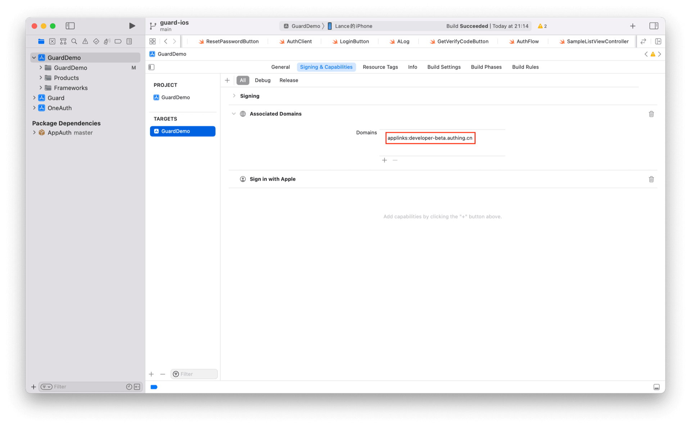
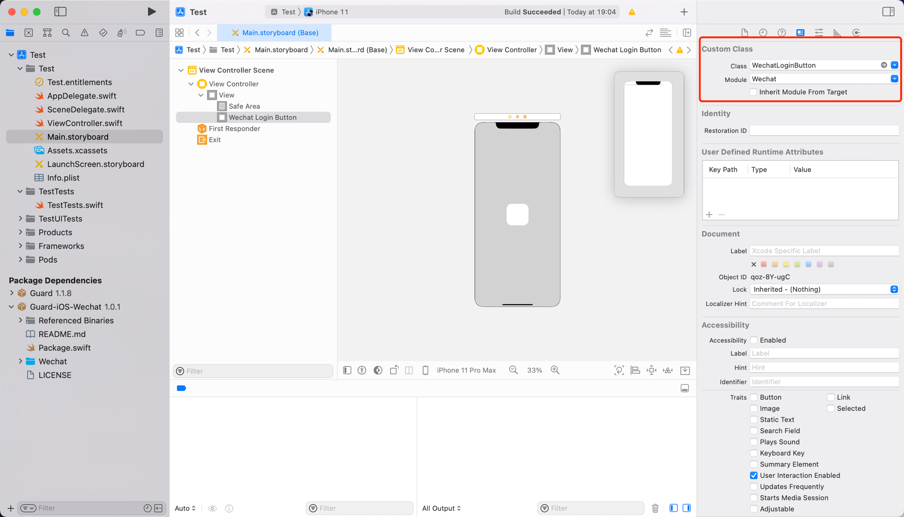

# 微信登录

<LastUpdated/>

## 准备工作

在 [微信开放平台](https://open.weixin.qq.com/cgi-bin/index?t=home/index&lang=zh_CN) 及 [Authing 管理控制台](https://www.authing.cn/) 进行配置请参阅 [微信移动端](https://docs.authing.cn/v2/guides/connections/social/wechat-mobile/)。


<br>

## 集成微信登录

### 第一步：添加微信登录依赖

1. 在 swift package 搜索栏输入：https://github.com/Authing/authing-binary 。

2. 选择 [Authing-binary](https://github.com/Authing/authing-binary)。
> [Authing-binary](https://github.com/Authing/authing-binary) 依赖于 [Guard-iOS SDK](https://github.com/Authing/guard-ios)。

3. 依赖规则选择 **Up to Next Major Version 1.0.0** 。

4. Add Package 后勾选 **Wechat** 。

<br>

### 第二步：Info.plist 里面添加启动微信白名单

key: LSApplicationQueriesSchemes

value: weixin, weixinULAPI

> 注意大小写


也可以通过 Source Code 方式打开 Info.plist，然后复制粘贴下面代码：

```xml
<plist version="1.0">
<dict>
    ...
    <key>LSApplicationQueriesSchemes</key>
	<array>
		<string>weixin</string>
		<string>weixinULAPI</string>
	</array>
    ...
</dict>
</plist>
```

<br>

### 第三步：初始化微信登录

```swift
import Guard
import Wechat
Authing.start(<#AUTHING_APP_ID#>)
WechatLogin.registerApp(appId: <#your_wechat_appid#>, universalLink: <#your_deep_link#>)
 ```

> 第一个参数为微信应用 ID；第二个参数为 iOS [Universal Link](https://developer.apple.com/ios/universal-links/)

<br>

### 第四步：设置 Associated Domains：

> 填入开发者的 Universal Link 对应的 host 。



<br>

### 第五步：处理微信登录回调

微信返回应用后，如果使用了 SceneDelegate，则需要在 SceneDelegate.swift 里面重载下面的函数：

```swift
func scene(_ scene: UIScene, continue userActivity: NSUserActivity) {
    NotificationCenter.default.post(name: NSNotification.Name(rawValue: "wechatLoginOK"), object: userActivity)
}
```

如果未使用 SceneDelegate，则需要在 AppDelegate 里面重载：

```swift
func application(_ application: UIApplication, continue userActivity: NSUserActivity, restorationHandler: @escaping ([UIUserActivityRestoring]?) -> Void) -> Bool {
    NotificationCenter.default.post(name: NSNotification.Name(rawValue: "wechatLoginOK"), object: userActivity)
    return true
}
```

<br>

### 第六步：发起微信登录授权

推荐通过我们提供的语义化 Hyper Component，只需要在 xib 里面放置一个：

```swift
WechatLoginButton
```
设置 Module 为 Wechat


如果不想使用我们内置的按钮，则可以在自己按钮的点击事件里面调用 Authing 微信登录 API：

```swift
WechatLogin.login(viewController: <#承载视图的ViewController#>) { code, message, userInfo in
    if (code == 200) {
        // userInfo：用户信息
    }
}
```

所有的逻辑由我们语义化引擎自动处理。如果想自己实现微信登录，拿到授权码后，可以调用下面 API 换取 Authing 用户信息：

```swift
func loginByWechat(_ code: String, completion: @escaping(Int, String?, UserInfo?) -> Void)
```

**参数**

* *authCode* 微信授权码

**示例**

```swift
AuthClient().loginByWechat(authCode) { code, message, userInfo in
    if (code == 200) {
        // userInfo：用户信息
    }
}
```