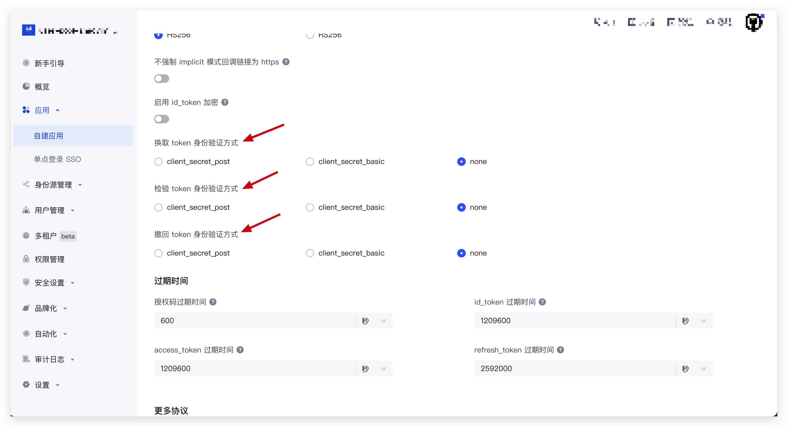
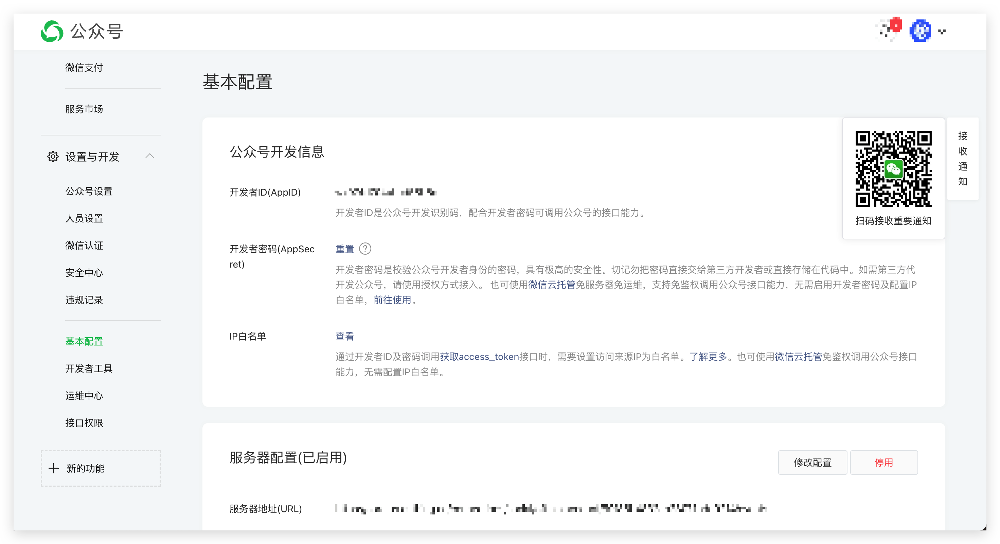
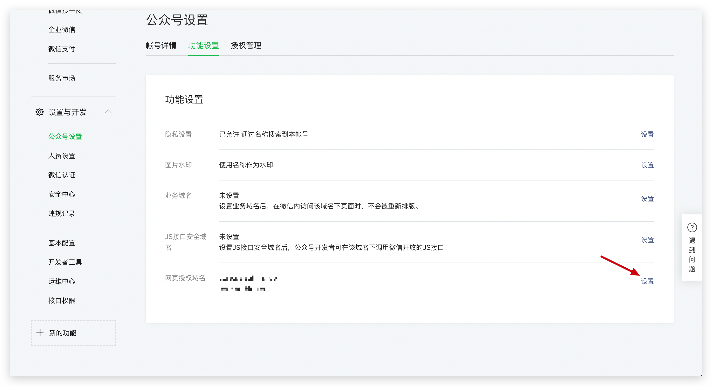
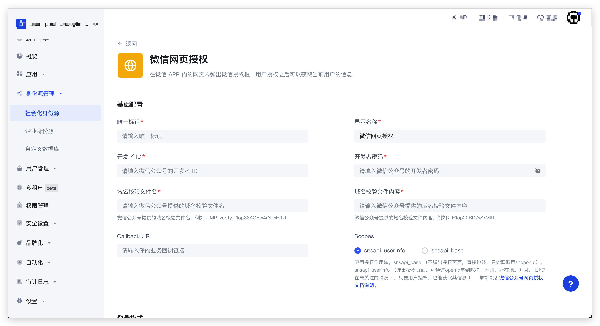
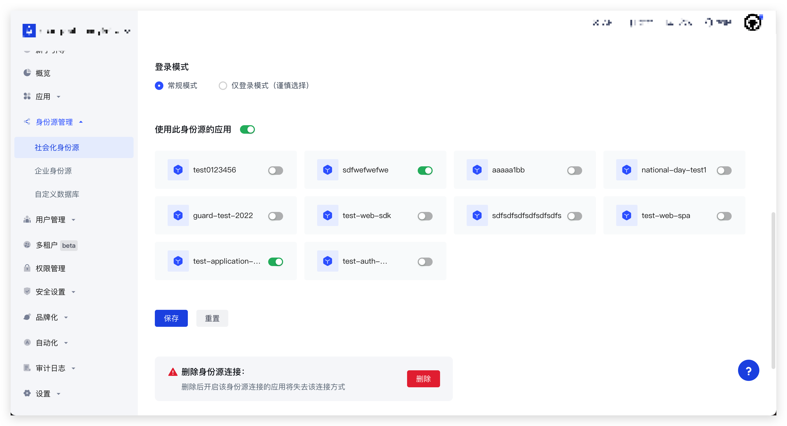

# 微信网页授权登录 SDK

::: hint-info
Authing 微信网页授权 SDK，五分钟接入微信网页授权登录。
:::

## 说明

[Authing 微信网页授权 SDK 5.0](https://github.com/Authing/authing-js-sdk/tree/master/packages/weixin-official-account) 于 2022 年 9 月 7 日发布，推荐使用 5.0 及以上版本，低于 5.0 的版本将不再维护！

如果你正在使用之前的版本，仍然可以参考：[微信网页授权登录 SDK](https://docs.authing.cn/v2/reference/sdk-for-wxmp.html)。

Authing 微信网页授权登录 SDK 5.0 主要有以下几个优势：

- 包名变更为`@authing/weixin-official-account`，让开发者更直观的知道该 SDK 的使用场景和范围。
- 增加了全面的 `TS` 类型支持，让开发者在集成开发过程中更得心应手。
- 修复了 `checkWechatUA` 函数的 Bug，能正确判断是否处于微信网页浏览器环境。

## 第一步：创建应用

1. 使用 Authing 创建一个应用：

<ul style="padding-left: 50px">
  <li>进入<a href="https://console.authing.cn/" target="blank">控制台</a>；</li>
  <li>展开左侧 <strong>应用</strong> 菜单，点击 <strong>自建应用</strong> 菜单；</li>
  <li>点击右上角 <strong>创建自建应用</strong> 按钮；</li>
  <li>填写 <strong>应用名称</strong>、<strong>认证地址</strong>、选择 <strong>标准 Web 应用</strong>；</li>
  <li>点击 <strong>创建</strong>。</li>
</ul>


2. 以下身份验证方式选择 <strong>none</strong>

<p>应用创建成功之后，在 <strong>自建应用</strong> 列表，点击该应用，点击 <strong>应用配置</strong> 标签，找到 <strong>其他配置</strong>，点击展开，找到以下三种身份认证方式并全部设置为 <strong>none</strong>。</p>

::: hint-info
前端应用不适合存储密钥，这会造成密钥泄漏。
:::



<br />

3. 保存当前配置

## 第二步：创建社会化身份源

1. 前往[微信公众平台](https://mp.weixin.qq.com/) 注册

    - **选择服务号（订阅号也可用于测试，生产环境建议使用服务号）**
    - **必须通过微信认证**

2. 在微信公众平台后台的 <strong>设置与开发 -> 基本配置</strong> 页面获取 <strong>开发者 ID(AppID)</strong> 和 <strong>开发者密码(AppSecret)</strong>。



3. 在微信公众平台后台的 <strong>设置与开发 -> 公众号设置 -> 功能设置</strong> 页面添加 <strong>网页授权域名</strong>。

  - **域名填写 Authing 的统一回调域名：`core.authing.cn`**。
  - **出于安全验证考虑，微信服务器需要和 Authing 服务器做一次请求验证，开发者需要下载 `txt 文件`，并记录 `文件名` 和 `文本内容`**。



4. 在 Authing 控制台 <strong>身份源管理 -> 社会化身份源 -> 创建社会化身份源 -> 微信 -> 微信网页授权</strong> 创建一个微信社会化身份源。



|字段|说明|
|----|----|
|唯一标识|因为这是此连接的唯一标识，所以设置之后不能修改|
|显示名称|Authing 登录表单将会显示一个“{Display Name} 登录”的按钮|
|开发者ID|微信公众号后台 -> 设置与开发 -> 基本配置 -> 公众号开发信息 -> 开发者ID(AppID)|
|开发者密码|微信公众号后台 -> 设置与开发 -> 基本配置 -> 公众号开发信息 -> 开发者密码(AppSecret)|
|域名校验文件名|前面记录的 txt 文件名|
|域名校验文件内容|前面记录的 txt 文本内容|
|Callback URL|你的业务回调链接，必填。配置的回调地址支持使用通配符，例如你配置的回调地址为`https://*.example.com/*`，下面的回调地址也是允许的：`https://forum.example.com/t/topic/1234`|

<p>以上内容填写完成后，点击 <strong>创建</strong> 按钮进行保存</p>。

5. 在当前页面选择 **使用此身份源的应用** 并点击 **保存** 按钮再次保存。



## 第三步：安装 SDK

:::: tabs :options="{ useUrlFragment: false }"
::: tab NPM
``` shell
npm install --save @authing/weixin-official-account
```
:::

::: tab Yarn
``` shell
yarn add @authing/weixin-official-account
```
:::

::: tab CDN
```html
<script src="https://cdn.authing.co/packages/weixin-official-account/5.1.0/weixin-official-account.min.js"></script>
```
:::
::::

## 第四步：初始化 SDK

:::: tabs :options="{ useUrlFragment: false }"
::: tab NPM
``` typescript
import { AuthingWxmp } from '@authing/weixin-official-account'

const authingWx = new AuthingWxmp({
  // 此社会化身份源的唯一标志，你在 Authing 控制台创建微信身份源的时候填写的
  identifier: "AUTHING_IDENTIFIER",

  appId: "AUTHING_APP_ID",

  // Authing 控制台 -> 选择已创建的小程序应用 -> 应用配置 -> -> 认证配置 -> 认证地址
  host: "https://my-awesome-app.authing.cn",

  // Authing 控制台 -> 选择已创建的小程序应用 -> 应用配置 -> -> 认证配置 -> 登录回调 URL
  redirectUrl: 'https://my-awesome-app.authing.cn/callback'
})
```
:::

::: tab CDN
``` typescript
const authingWx = new AuthingFactory.AuthingWxmp({
  // 此社会化身份源的唯一标志，你在 Authing 控制台创建微信身份源的时候填写的
  identifier: "AUTHING_IDENTIFIER",

  appId: "AUTHING_APP_ID",

  // Authing 控制台 -> 选择已创建的小程序应用 -> 应用配置 -> -> 认证配置 -> 认证地址
  host: "https://my-awesome-app.authing.cn",

  // Authing 控制台 -> 选择已创建的小程序应用 -> 应用配置 -> -> 认证配置 -> 登录回调 URL
  redirectUrl: 'https://my-awesome-app.authing.cn/callback'
})
```
:::
::::

## 第五步：使用 SDK

### 判断当前环境是否为微信客户端
``` typescript
const isWeixin = authingWx.checkWechatUA()
```

### 发起微信授权

``` typescript
// login.js
window.location = authingWx.getAuthorizationUrl()
```

### 获取用户信息
``` typescript
// callback.js
const { ok, userInfo, message } = authingWx.getUserInfo()

if (ok) {
  console.log('userInfo: ', userInfo)
} else if (message) {
  console.log(message)
}
```

## 示例代码

当前文档对应的完整示例代码请参考：[examples](https://github.com/Authing/authing-js-sdk/tree/master/examples/weixin-official-account)。